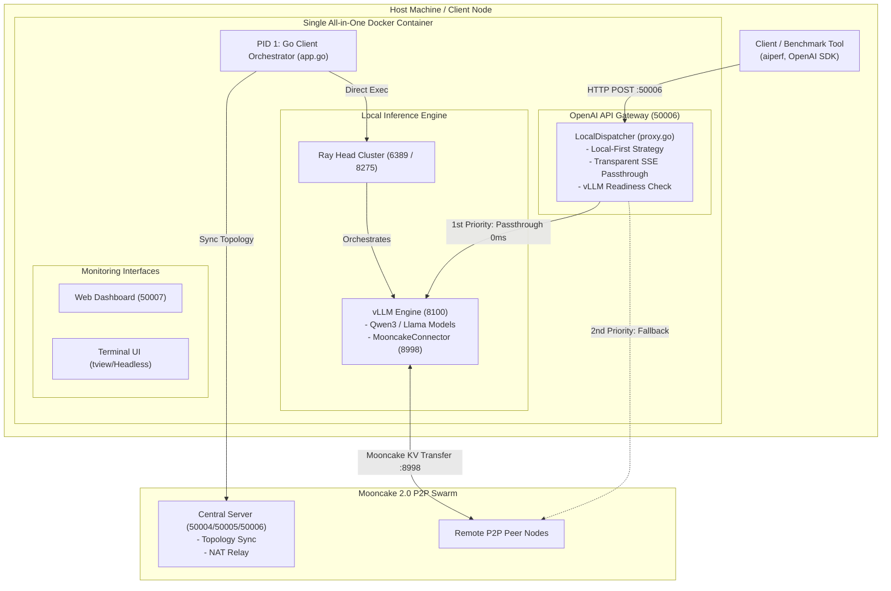

# Mooncake 2.0 P2P LLM Inference Client Agent

[](https://golang.org)
[](https://developer.nvidia.com/cuda-toolkit)
[](https://github.com/vllm-project/vllm)
[](LICENSE)

An all-in-one, high-performance **P2P Large Language Model (LLM) Inference Client Agent** built with Go, libp2p, Ray, and vLLM. 

Mooncake 2.0 Client provides an OpenAI-compatible API Gateway (`/v1/chat/completions`) with **Local-First Proxy Routing**, **Zero-Buffer SSE Streaming**, **vLLM Readiness Health Checking**, and **Mooncake KV Cache Transfer Engine** integration for distributed Prefill/Decode (P/D) inference swarms.

---

## 🏛 System Architecture



---

## ✨ Key Features

- **🚀 Local-First Proxy & Zero-Buffer SSE Streaming**:
  Directly pipes incoming HTTP requests to the local GPU-accelerated vLLM engine (`http://127.0.0.1:8100`) using zero-buffer chunked streaming (`http.Flusher`). Delivers instant responses with 0ms network overhead and full Server-Sent Events (SSE) compatibility for benchmark tools like `aiperf`.

- **⚡ Atomic vLLM Readiness Health Check**:
  Background polling tracks vLLM startup and model weight allocation via `http://127.0.0.1:8100/health`. Automatically suppresses connection errors during the 15-30 second warmup phase and silently defers to P2P swarm backup when unready.

- **📦 Single-Container All-in-One Deployment**:
  Runs cleanly inside a single Multi-Stage Docker container. The Go agent operates as **PID 1**, natively starting and managing Ray Head and vLLM processes without requiring `/var/run/docker.sock` mounts or host shell scripts.

- **🖥️ Dual Interface Support (Interactive TUI & Headless Mode)**:
  Features an interactive terminal UI powered by `tview` and `tcell`. Automatically detects non-TTY environments (such as headless Docker containers) and seamlessly falls back to background headless mode while keeping API endpoints operational.

- **🌐 P2P Swarm & Mooncake KV Cache Transfer**:
  Connects to the Mooncake 2.0 central relay over libp2p. Participates in disaggregated Prefill/Decode (P/D) inference topologies, exchanging KV Caches across GPU nodes via `MooncakeConnector` on port `8998`.

---

## 📁 Repository Structure

```
.
├── Dockerfile              # Multi-stage CUDA 13 + vLLM + Go Agent Docker build
├── docker-compose.yml      # Single service Compose configuration
├── config.json             # Application runtime settings (VRAM, ports, paths)
├── mooncake.json           # Mooncake KV cache transfer engine settings
│
├── main.go                 # Application entry point & OS signal listener
├── app.go                  # Master application container & service lifecycle
├── config.go               # Configuration parser & environment variable auto-detector
├── proxy.go                # OpenAI API Gateway dispatcher & streaming proxy
├── p2p.go                  # libp2p node, peer discovery & GossipSub network
├── runner.go               # Process orchestrator (Ray + vLLM direct manager)
├── sys.go                  # Hardware metrics & NVML GPU telemetry
├── tui.go                  # Interactive TUI & headless fallback manager
├── web.go                  # Web Dashboard server & static asset host
│
├── web/                    # Static Web Dashboard frontend assets
├── .env.example            # Environment configuration template
├── swarm.key.example       # Libp2p private network key template
├── .gitignore              # Git tracking exclusion rules
└── LICENSE                 # Apache 2.0 License
```

---

## 🔌 Network Ports

| Port | Protocol | Description |
| :--- | :--- | :--- |
| **`50006`** | HTTP | OpenAI-Compatible API Gateway (`/v1/chat/completions`, `/v1/models`) |
| **`50007`** | HTTP | Web Monitoring Dashboard |
| **`8100`** | HTTP | Local vLLM Inference Engine Endpoint |
| **`8998`** | TCP/HTTP | Mooncake KV Cache Transfer Engine Bootstrap Port |
| **`50004`** | TCP/libp2p | Central Server P2P Bootstrap & NAT Relay Port |

---

## 🚀 Quick Start

### Prerequisites
- [Docker](https://docs.docker.com/get-docker/) & [Docker Compose](https://docs.docker.com/compose/)
- NVIDIA GPU with [Nvidia Container Toolkit](https://docs.nvidia.com/datacenter/cloud-native/container-toolkit/latest/install-guide.html) installed
- Local LLM Model directory (e.g. `Qwen3-4B-AWQ` or HuggingFace format)

### 1. Environment Setup

Clone the repository and copy the environment template:

```bash
git clone https://github.com/your-org/mooncake2.0-client.git
cd mooncake2.0-client

cp .env.example .env
```

Edit `.env` to set your local host model path:

```env
ABS_MODEL_PATH=/home/user/models/Qwen3-4B-AWQ
IFACE=eth0
CLIENT_WEB_PORT=50007
```

### 2. Build and Launch Container

Start the All-in-One container via Docker Compose:

```bash
docker compose up -d --build
```

### 3. Verify System Health

Check the API Gateway health status:

```bash
curl http://localhost:50006/health
# Output: OK
```

List available models:

```bash
curl http://localhost:50006/v1/models
```

### 4. Execute Inference

Send an OpenAI-compatible chat completion request:

```bash
curl http://localhost:50006/v1/chat/completions \
  -H "Content-Type: application/json" \
  -d '{
    "model": "Qwen3-4B-AWQ",
    "messages": [{"role": "user", "content": "Hello! Explain quantum computing in 2 sentences."}],
    "temperature": 0.7
  }'
```

---

## ⚙️ Configuration Reference

Main settings are configured in `config.json`:

```json
{
  "proxy_port": 50006,
  "web_port": 50007,
  "vllm": {
    "port": 8100,
    "model_name": "Qwen3-4B-AWQ",
    "gpu_memory_utilization": 0.75,
    "max_model_len": 8192,
    "kv_role": "kv_both",
    "mooncake_bootstrap_port": 8998
  }
}
```

---

## 📜 License

Distributed under the **Apache License 2.0**. See [`LICENSE`](LICENSE) for more information.
