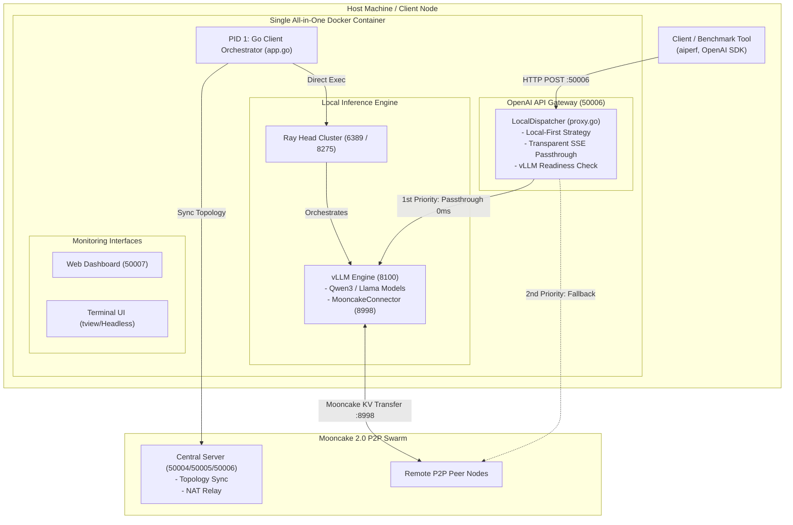

# Mooncake 2.0 P2P LLM Inference Client Agent

[](https://github.com/lhu-csie-dclab/yuanyi/actions)
[](https://golang.org)
[](https://developer.nvidia.com/cuda-toolkit)
[](https://github.com/vllm-project/vllm)
[](https://github.com/kvcache-ai/Mooncake)
[](LICENSE)

An all-in-one, high-performance **P2P Large Language Model (LLM) Inference Client Agent** built with Go, libp2p, Ray, and vLLM. 

Mooncake 2.0 Client provides an OpenAI-compatible API Gateway (`/v1/chat/completions`) with **Local-First Proxy Routing**, **Zero-Buffer SSE Streaming**, **vLLM Readiness Health Checking**, and **Mooncake KV Cache Transfer Engine** (`mooncake-transfer-engine-cuda13==0.3.10.post2`) integration for distributed Prefill/Decode (P/D) inference swarms.

---

> [!WARNING]
> **Experimental Stage Disclaimer (實驗階段與正式環境部署警語)**
> - **Experimental Research Software**: This project is currently in an **experimental research phase** and is **NOT RECOMMENDED for production (Production) environments**.
> - **Untested Parameters Notice**: Only the explicitly documented baseline configuration (`Qwen3-4B-AWQ`, `protocol: "tcp"`, `concurrency: 100`) has been stress-tested. All other unverified parameters, alternative transport layers, or unlisted models remain **untested** and may produce unstable results.

---

## 📚 Documentation & Architecture Index

For deep-dive technical documentation, multi-layered architectural specifications, and module reference guides, see:

- **[📖 Layered Architecture Specification (`docs/ARCHITECTURE.md`)](docs/ARCHITECTURE.md)**: Full 7-layer functional breakdown (Orchestrator, Gateway, P2P Swarm, Process Manager, Telemetry, UI) including original code design algorithms.
- **[📦 Master App Container Specification (`docs/APP_CONTAINER.md`)](docs/APP_CONTAINER.md)**: Detailed specification of `app.go`, covering struct handles, instantiation, execution flow, and teardown sequence.
- **[⚙️ Configuration Management Guide (`docs/CONFIG.md`)](docs/CONFIG.md)**: Comprehensive guide for `config.go`, `config.json`, `.env.example`, and `mooncake.json`.
- **[🌐 P2P Mesh Network & Swarm Key Guide (`docs/P2P_NETWORK.md`)](docs/P2P_NETWORK.md)**: Detailed guide for `p2p.go`, Badger DB peerstore, GossipSub, TCP VIP proxies, and `swarm.key` generation.
- **[🔀 OpenAI API Gateway & Proxy Guide (`docs/GATEWAY_PROXY.md`)](docs/GATEWAY_PROXY.md)**: Detailed guide for `proxy.go`, Local-First transparent SSE streaming, vLLM health check, and P/D scheduler.
- **[🏃 Process Management & Docker Stack Guide (`docs/RUNNER_DOCKER.md`)](docs/RUNNER_DOCKER.md)**: Detailed guide for `runner.go`, `Dockerfile`, `docker-compose.yml`, and Ray/vLLM orchestration.
- **[📊 System Telemetry & Metrics Guide (`docs/TELEMETRY_SYS.md`)](docs/TELEMETRY_SYS.md)**: Detailed guide for `sys.go`, vLLM Prometheus metrics scraping, NVML GPU stats, and `stats.json`.
- **[🖥️ User Interfaces & Web Dashboard Guide (`docs/DASHBOARD_UI.md`)](docs/DASHBOARD_UI.md)**: Detailed guide for `tui.go` (4-tab terminal console, headless mode) and `web.go` (embedded Web UI on port `50007`).
- **[📈 NVIDIA AIPerf Benchmark & Stress Test Results (`docs/test/BENCHMARK_RESULTS.md`)](docs/test/BENCHMARK_RESULTS.md)**: Official 10,000 requests stress test results evaluated on 10 x RTX A2000 8GB GPUs using NVIDIA AIPerf.
- **[🗂 Module & Function Reference Guide (`docs/MODULES.md`)](docs/MODULES.md)**: File-by-file index of data structures, struct definitions, and cross-module call matrices.

---

## 🏛 System Architecture



---

## ✨ Key Features

- **🚀 Local-First Proxy & Zero-Buffer SSE Streaming**:
  Directly pipes incoming HTTP requests to the local GPU-accelerated vLLM engine (`http://127.0.0.1:8100`) using zero-buffer chunked streaming (`http.Flusher`). Delivers instant responses with 0ms network overhead and full Server-Sent Events (SSE) compatibility for benchmark tools like `aiperf`.

- **⚡ Atomic vLLM Readiness Health Check**:
  Background polling tracks vLLM startup and model weight allocation via `http://127.0.0.1:8100/health`. Automatically suppresses connection errors during the 15-30 second warmup phase and silently defers to P2P swarm backup when unready.

- **📦 Single-Container All-in-One Deployment**:
  Runs cleanly inside a single Multi-Stage Docker container. The Go agent operates as **PID 1**, natively starting and managing Ray Head and vLLM processes without requiring `/var/run/docker.sock` mounts or host shell scripts.

- **🖥️ Dual Interface Support (Interactive TUI & Headless Mode)**:
  Features an interactive terminal UI powered by `tview` and `tcell`. Automatically detects non-TTY environments (such as headless Docker containers) and seamlessly falls back to background headless mode while keeping API endpoints operational.

- **🌐 P2P Swarm & Mooncake KV Cache Transfer**:
  Connects to the Mooncake 2.0 central relay over libp2p. Participates in disaggregated Prefill/Decode (P/D) inference topologies, exchanging KV Caches across GPU nodes via `MooncakeConnector` on port `8998`.

---

## 📁 Repository Structure

```
.
├── Dockerfile              # Multi-stage CUDA 13 + vLLM + Go Agent Docker build
├── docker-compose.yml      # Single service Compose configuration
├── config.json             # Application runtime settings (VRAM, ports, paths)
├── mooncake.json           # Mooncake KV cache transfer engine settings
│
├── main.go                 # Application entry point & OS signal listener
├── app.go                  # Master application container & service lifecycle
├── config.go               # Configuration parser & environment variable auto-detector
├── proxy.go                # OpenAI API Gateway dispatcher & streaming proxy
├── p2p.go                  # libp2p node, peer discovery & GossipSub network
├── runner.go               # Process orchestrator (Ray + vLLM direct manager)
├── sys.go                  # Hardware metrics & NVML GPU telemetry
├── tui.go                  # Interactive TUI & headless fallback manager
├── web.go                  # Web Dashboard server & static asset host
│
├── web/                    # Static Web Dashboard frontend assets
├── .env.example            # Environment configuration template
├── swarm.key.example       # Libp2p private network key template
├── .gitignore              # Git tracking exclusion rules
└── LICENSE                 # Apache 2.0 License
```

---

## 🔌 Network Ports Allocation & Reference Matrix

Available port mapping referenced across the system (`config.json`, `.env`, Python Ray, and Docker container):

| Port | Protocol | Layer / Service | Source / Reference | Description |
| :--- | :--- | :--- | :--- | :--- |
| **`50006`** | HTTP | OpenAI API Gateway | `config.json` (`proxy_port`) | Client API entrypoint (`/v1/chat/completions`, `/v1/models`) |
| **`50007`** | HTTP | Web UI Dashboard | `config.json` / `.env` (`CLIENT_WEB_PORT`) | Visual monitoring web console and stats API |
| **`8100`** | HTTP | vLLM Engine | `config.json` (`vllm.port`) | Local GPU vLLM inference server endpoint |
| **`8998`** | TCP/HTTP | Mooncake Engine | `config.json` (`mooncake_bootstrap_port`) | Mooncake KV Cache transfer control & negotiation port |
| **`6389`** | TCP | Python Ray Cluster | Ray Head (`--port`) | Ray distributed execution head node port |
| **`8275`** | HTTP | Python Ray Dashboard | Ray Head (`--dashboard-port`) | Ray cluster management dashboard |
| **`50004`** | TCP/libp2p | Central Server | `config.json` (`p2p.server_address`) | Central bootstrap tracker & NAT relay multiaddress port |

---

## 🛠️ Prerequisites & Installation Guide

### 1. Git Installation & Repository Cloning
Install `git` on your system and clone the repository:

```bash
# Ubuntu / Debian
sudo apt-get update && sudo apt-get install -y git git-lfs

# Clone repository
git clone https://github.com/lhu-csie-dclab/yuanyi.git
cd yuanyi
```

### 2. Go Environment & Local Compilation
This project requires **Go version 1.26.0 or higher** for native compilation and agent development:

```bash
# Verify Go version (requires 1.26.0+)
go version

# Build local executable binary
go build -v .
```

### 3. Docker Installation on Ubuntu
Building the multi-stage container (`Dockerfile`) requires Docker Engine. Follow the official [Docker Engine Installation on Ubuntu](https://docs.docker.com/engine/install/ubuntu/) guide:

```bash
# Uninstall old versions
sudo apt-get remove docker docker-engine docker.io containerd runc

# Set up Docker repository
sudo apt-get update
sudo apt-get install -y ca-certificates curl gnupg
sudo install -m 0755 -d /etc/apt/keyrings
curl -fsSL https://download.docker.com/linux/ubuntu/gpg | sudo gpg --dearmor -o /etc/apt/keyrings/docker.gpg
sudo chmod a+r /etc/apt/keyrings/docker.gpg

echo \
  "deb [arch="$(dpkg --print-architecture)" signed-by=/etc/apt/keyrings/docker.gpg] https://download.docker.com/linux/ubuntu \
  "$(. /etc/os-release && echo "$VERSION_CODENAME")" stable" | \
  sudo tee /etc/apt/sources.list.d/docker.list > /dev/null

# Install Docker Engine & Docker Compose
sudo apt-get update
sudo apt-get install -y docker-ce docker-ce-cli containerd.io docker-buildx-plugin docker-compose-plugin

# Verify Docker installation
docker --version
```

> [!NOTE]
> **Docker Build Dependency**: The runtime container installs the official CUDA 13 Mooncake Transfer Engine package:
> ```dockerfile
> RUN pip install --no-cache-dir "ray[default,adag]" "mooncake-transfer-engine-cuda13==0.3.10.post2"
> ```

### 4. NVIDIA GPU Container Toolkit
Ensure the [NVIDIA Container Toolkit](https://docs.nvidia.com/datacenter/cloud-native/container-toolkit/latest/install-guide.html) is installed so Docker containers can access local GPU accelerators.

#### 🧪 Verified Test Environment (測試環境驗證規格)
The system has been fully benchmarked and verified under the following LXC container environment:

| Category | Specification |
| :--- | :--- |
| **Virtualization / Hypervisor** | **Proxmox VE 9.1** (LXC Container) |
| **LXC OS Template** | `ubuntu-26.04-standard_26.04-1_amd64.tar.zst` |
| **NVIDIA Host Driver Version** | `595.71.05` |
| **CUDA Toolkit Version** | `13.2` |
| **GPU Compute Capability** | **`7.5`** (Turing Architecture) |

### 5. Download Demonstration Model (`Qwen3-4B-AWQ`)
The recommended demonstration model is **[Qwen/Qwen3-4B-AWQ](https://huggingface.co/Qwen/Qwen3-4B-AWQ)** from Hugging Face:

```bash
# Install Git LFS
git lfs install

# Download Qwen3-4B-AWQ model to local directory
mkdir -p /home/user/models
cd /home/user/models
git clone https://huggingface.co/Qwen/Qwen3-4B-AWQ
```

---

## 🚀 Quick Start & Deployment

### 1. Environment Configuration

Copy the environment template file:

```bash
cp .env.example .env
```

Configure `.env` to point `ABS_MODEL_PATH` to your local `Qwen3-4B-AWQ` model path:

```env
# Absolute path to local HuggingFace / AWQ model weights
ABS_MODEL_PATH=/home/user/models/Qwen3-4B-AWQ
IFACE=eth0
CLIENT_WEB_PORT=50007
```

### 2. Build and Launch Container

Build the Dockerfile and start the All-in-One service via Docker Compose:

```bash
docker compose up -d --build
```

### 3. Verify System Health

Check the API Gateway health status (`50006`):

```bash
curl http://localhost:50006/health
# Output: OK
```

Query supported models:

```bash
curl http://localhost:50006/v1/models
```

### 4. Execute Chat Completion

Send an OpenAI-compatible request using `Qwen3-4B-AWQ`:

```bash
curl http://localhost:50006/v1/chat/completions \
  -H "Content-Type: application/json" \
  -d '{
    "model": "Qwen3-4B-AWQ",
    "messages": [{"role": "user", "content": "Hello! Explain quantum computing in 2 sentences."}],
    "temperature": 0.7
  }'
```

---

## ⚙️ Configuration Reference

Default settings in `config.json`:

```json
{
  "web_port": 50007,
  "proxy_port": 50006,
  "vllm": {
    "port": 8100,
    "model_name": "Qwen3-4B-AWQ",
    "gpu_memory_utilization": 0.75,
    "max_model_len": 8192,
    "kv_role": "kv_both",
    "mooncake_bootstrap_port": 8998
  }
}
```

Mooncake transport settings in `mooncake.json` (`"protocol": "tcp"`):

```json
{
  "metadata_server": "P2PHANDSHAKE",
  "global_segment_size": "0",
  "local_buffer_size": "17179869184",
  "protocol": "tcp",
  "device_name": ""
}
```

---

## 🙏 Acknowledgements & Credits

Mooncake 2.0 Client Agent is built upon and integrates with the following outstanding open-source projects and platforms:

- **[vLLM](https://github.com/vllm-project/vllm)** - A high-throughput and memory-efficient inference and serving engine for LLMs.
- **[Mooncake](https://github.com/kvcache-ai/Mooncake)** - KVCache-centric Disaggregated Architecture for LLM Serving.
- **[go-libp2p](https://github.com/libp2p/go-libp2p)** - Modular P2P networking library powering the decentralized mesh network.
- **[Ray](https://github.com/ray-project/ray)** - Unified framework for scaling AI and Python applications.
- **[aiperf](https://github.com/ai-dynamo/aiperf)** (`nvcr.io/nvidia/ai-dynamo/aiperf`) - Generative AI benchmark suite for load testing LLM inference services.

---

## 📜 License

Distributed under the **Apache License 2.0**. See [`LICENSE`](LICENSE) for more information.
