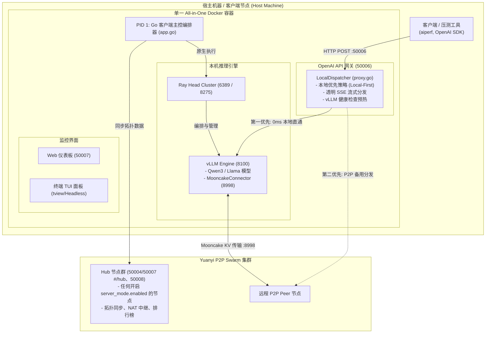

[English](README.md) | [繁體中文](README_zh-TW.md) | [简体中文](README_zh-CN.md)

# Yuanyi P2P LLM 推理客户端 Agent

[](https://github.com/lhu-csie-dclab/yuanyi/actions)
[](https://github.com/lhu-csie-dclab/yuanyi/actions)
[](https://github.com/lhu-csie-dclab/yuanyi/actions)
[](https://github.com/lhu-csie-dclab/yuanyi/actions)
[](https://golang.org)
[](https://developer.nvidia.com/cuda-toolkit)
[](https://github.com/vllm-project/vllm)
[](https://github.com/kvcache-ai/Mooncake)
[](LICENSE)

一个去中心化的 P2P LLM 推理网络——**任何有 GPU 的人都能贡献算力**，**任何有网络的人都能使用大语言模型**——无论是在家里、在数据中心、还是用手机移动网络。

一个可执行文件、一把共享密钥，你就是全球 GPU 网格的一部分。不需要中央服务器。

---

## 为什么选择 Yuanyi？

**在任何地方跑 LLM，由世界各地的 GPU 驱动。**

传统的 LLM 部署把你锁在一台机器或一个云端服务商上。Yuanyi 把每一张参与的 GPU 变成全球推理网络的一个节点：

- **Prefill/Decode (P/D) 分离** — 推理流程拆分到不同节点：一台机器负责高运算量的 prefill 阶段，另一台处理 token 生成。底层使用 [vLLM](https://github.com/vllm-project/vllm) 原生 P/D 分离搭配 [Mooncake KV-cache 传输](https://github.com/kvcache-ai/Mooncake)，KV cache 在 GPU 之间直接通过网络传送，无需重新计算。

- **真正的 P2P 无中心依赖** — 基于 [libp2p](https://github.com/libp2p/go-libp2p)，采用 Kademlia DHT、GossipSub 以及自动 NAT 穿越（Hole Punching、UPnP、中继）。局域网通过 mDNS 自动发现，广域网通过 bootstrap 种子连接。任意数量的节点都可以充当 Hub——没有单点故障。

- **任何 NAT 环境都能运行，包括手机网络** — 在 NAT4、CGNAT 或电信级防火墙后方的节点，仍然可以通过内置的 Circuit Relay 参与。只要有一个可达的中继节点，**每个节点都能连上任何其他节点**——你家路由器后面的电脑、云端 VM、手机热点，全部在同一个 swarm 里。

- **一把密钥 = 一个私有网络** — 一个 `swarm.key` 文件决定谁能加入。把它分享给你的团队、实验室或朋友——携带相同密钥的节点会自动形成加密的私有网格。不需要账号、不需要 API token、不需要注册。

- **每个人都能贡献** — 有强力 GPU？为网络执行推理。完全没有 GPU？用**纯中继模式**贡献网络带宽，让 NAT 后方的节点能够互连。每一位参与者都让网络更强大。

- **访问地球上每一张已连接的 GPU** — 你的本地网关（`/v1/chat/completions`）完全兼容 OpenAI API。当你自己的 GPU 忙碌或不存在时，请求会自动派发到 swarm 中最佳的可用节点。一个端点，全球 GPU 访问。

- **GPU 排行榜与智能路由** — 每个节点每 3 秒广播自己的 GPU 规格与吞吐量指标。Hub 节点使用 [gpu-info-api](https://github.com/voidful/gpu-info-api) 数据集，根据硬件能力（VRAM、型号、数量）为 GPU 评分，并发布实时排行榜。分发器会将请求路由到最快的可用节点。

---

> [!WARNING]
> **实验阶段与生产环境部署警告 (Experimental Stage Disclaimer)**
> - **实验研究阶段项目**：本软件目前处于**实验研究阶段**，**不推荐在正式生产环境 (Production) 部署使用**。
> - **未测试参数声明**：目前仅有文档明确记载的基准配置（`Qwen3-4B-AWQ`, `protocol: "tcp"`, `concurrency: 100`）经过压力测试验证；**其余未经测试的参数、传输协议或模型未经完整验证**，可能产生不可预期的系统行为。

> [!WARNING]
> **隐私警告：分发到远端节点的 Prompt，该节点运营者看得到明文**
> - 当本机 GPU 忙碌时，请求会被分发到 **Swarm 中的其他机器**；这些机器必须解密才能执行推理。本项目**没有应用层加密**，而且以目前技术而言 LLM 推理也做不到（同态加密不实用）。
> - `swarm.key` 控制的是**谁能加入**，不是「加入后能对收到的数据做什么」。Swarm 里**每一位节点运营者都被隐含信任**能接触到用户的 Prompt。
> - 你的节点还会**每 3 秒把你的 IP 地址、显卡型号与使用习惯广播给所有 Peer**，同时也会收到别人的。而**别人的 Prompt 会在你的 GPU 上执行**。
> - **📋 加入任何 Swarm 之前，请先阅读 [用户须知 (`docs/zh_cn/USER_NOTICE.md`)](docs/zh_cn/USER_NOTICE.md)** —— 你会暴露什么、承担什么，以及共用 `swarm.key` 的风险。完整信任模型：**[`docs/SECURITY.md`](docs/SECURITY.md)**。

---

## 📚 技术文档与架构手册索引

关于深入的技术文档、多层次架构规范与模块参考手册，请参阅：

- **[📖 多层次系统架构规范 (`docs/zh_cn/ARCHITECTURE.md`)](docs/zh_cn/ARCHITECTURE.md)**：包含 8 大功能层级（编排器、网关、P2P Swarm、进程管理器、遥测、UI、可选的 Hub 模式）与算法说明。
- **[📦 Master App 容器规范 (`docs/zh_cn/APP_CONTAINER.md`)](docs/zh_cn/APP_CONTAINER.md)**：`app.go` 主容器结构体、依赖注入、启动与关机顺序。
- **[⚙️ 配置管理与参数手册 (`docs/zh_cn/CONFIG.md`)](docs/zh_cn/CONFIG.md)**：`config.go`、`config.json`、`.env.example` 与 `mooncake.json` 的完整指南。
- **[🌐 P2P 网络与 Swarm Key 手册 (`docs/zh_cn/P2P_NETWORK.md`)](docs/zh_cn/P2P_NETWORK.md)**：`p2p.go`、Badger DB Peerstore、GossipSub、VIP 代理与 `swarm.key` 密钥生成教程。
- **[🔀 OpenAI API 网关与代理手册 (`docs/zh_cn/GATEWAY_PROXY.md`)](docs/zh_cn/GATEWAY_PROXY.md)**：`proxy.go` 本地优先透明 SSE 流式传输、vLLM 健康检查与 P/D 调度器。
- **[🏃 进程管理与 Docker 堆栈手册 (`docs/zh_cn/RUNNER_DOCKER.md`)](docs/zh_cn/RUNNER_DOCKER.md)**：`runner.go`、`Dockerfile`、`docker-compose.yml` 与 Ray/vLLM 编排。
- **[📊 系统遥测与指标手册 (`docs/zh_cn/TELEMETRY_SYS.md`)](docs/zh_cn/TELEMETRY_SYS.md)**：`sys.go`、vLLM Prometheus 数据爬虫、NVML 显卡遥测与 `stats.json` 存档。
- **[🖥️ 终端 TUI 面板与 Web 仪表板手册 (`docs/zh_cn/DASHBOARD_UI.md`)](docs/zh_cn/DASHBOARD_UI.md)**：`tui.go`（4 分页终端面板、Headless 模式）与 `web.go`（`50007` 端口内嵌 Web Console）。
- **[📈 NVIDIA AIPerf 压测数据报告 (`docs/zh_cn/test/BENCHMARK_RESULTS.md`)](docs/zh_cn/test/BENCHMARK_RESULTS.md)**：在 10 张 RTX A2000 8GB 显卡上进行 1 万次请求压测的官方数据。
- **[🧬 多节点全新 Clone 与并发多卡测试 (`docs/zh_cn/test/MULTI_NODE_CLONE_TEST.md`)](docs/zh_cn/test/MULTI_NODE_CLONE_TEST.md)**：验证从零 `git clone` 部署到 2 台主机共 10 个独立节点后，10 张实体 GPU 各自真的在处理推理（单独测试与 10 台并发测试皆验证）。
- **[📋 用户须知 — 加入 Swarm 前必读 (`docs/zh_cn/USER_NOTICE.md`)](docs/zh_cn/USER_NOTICE.md)**：你的节点会广播你的哪些信息（IP、显卡、使用习惯）、你的 GPU 会跑到什么、共用 `swarm.key` 的风险，以及哪些内容绝对不该输入共用 Swarm。
- **[🔐 安全性与信任模型 (`docs/SECURITY.md`)](docs/SECURITY.md)**：本系统保护什么、不保护什么——为何远端节点看得到被分发的 Prompt、`swarm.key` 真正保证的范围，以及目前未加验证的对外接口。
- **[🖥️ Proxmox VE + LXC GPU 直通手册 (`docs/install/proxmox/README.md`)](docs/install/proxmox/README.md)**：宿主机驱动安装、创建 LXC、GPU 设备直通、嵌套 Docker 与 `no-cgroups` 关键修正——参考集群的 10 个节点就是这样建起来的。
- **[🐧 Ubuntu 安装与部署手册 (`docs/install/ubuntu/README.md`)](docs/install/ubuntu/README.md)**：主要且经过正式测试的部署平台——Docker Engine、NVIDIA Container Toolkit、`swarm.key`，以及 Docker 与原生编译两种部署路径。
- **[🪟 Windows 本机原生架设与部署手册 (`docs/install/windows/README.md`)](docs/install/windows/README.md)**：使用 `uv`、`.venv` 与 `SystemPanic/vllm-windows` 于 Windows 本机极速部署 vLLM + Qwen AWQ 的完整指南。
- **[🪟 Windows 原生部署验证测试 (`docs/test/WINDOWS_NATIVE_TEST.md`)](docs/test/WINDOWS_NATIVE_TEST.md)**：在 RTX 3080 Laptop 上实际跑完整条 Windows 原生路径的验证结果——构建、启动、单笔/顺序/并发/流式推理，以及这次测试揪出并修复的两个 Bug。
- **[🧪 实验阶段与未测试参数说明书 (`docs/zh_cn/EXPERIMENTAL.md`)](docs/zh_cn/EXPERIMENTAL.md)**：包含详细的实验研究范围、经测试的基准设置、未测试参数风险与生产环境免责声明。
- **[🗂 模块与 Function 参考指南 (`docs/zh_cn/MODULES.md`)](docs/zh_cn/MODULES.md)**：文件对照表、数据结构与跨模块调用矩阵。
- **[🛰️ Hub 模式手册 (`docs/zh_cn/HUB_MODE.md`)](docs/zh_cn/HUB_MODE.md)**：可选的中央服务器合并能力——节点数据库、GPU 算分、中央派发器、Hub 专属仪表板，以及多 Hub 一致性设计。

---

## 🏛 系统架构图 (System Architecture)



> 每个节点都运行同一份 client 可执行文件。一个节点只有在自己的 `config.json` 设置
> `server_mode.enabled: true` 时，才会成为上图 `Swarm` 中的 **Hub**；可以同时有任意数量的节点这样做，
> 并且任何节点无论是否兼任 Hub，都能作为 `ClientHost` 执行自己的推理。详见
> [`docs/zh_cn/HUB_MODE.md`](docs/zh_cn/HUB_MODE.md)。

---

## ✨ 核心特色 (Key Features)

- **🚀 本地优先代理与零延迟 SSE 流式传输 (Local-First & Zero-Buffer SSE)**：
  采用 `http.Flusher` 将传入的 HTTP 请求直接分发至本机 GPU 加速的 vLLM 引擎 (`http://127.0.0.1:8100`)。提供 0ms 网络额外开销与完全兼容于 `aiperf` 等压测工具的 Server-Sent Events (SSE) 流式传输。
- **⚡ 原子级 vLLM 健康预热检查 (Atomic vLLM Readiness)**：
  后台任务每 5 秒轮询 `http://127.0.0.1:8100/health`。在开机 15-30 秒的模型加载预热期间自动抑制报错，若本机未就绪则自动平滑退回 P2P Swarm 远程 Peer 执行。
- **📦 单一 All-in-One 容器化部署 (Single-Container All-in-One)**：
  运行于多阶段 Docker 容器中。Go Agent 作为 **PID 1** 原生管理 Ray Head 与 vLLM 进程，无需挂载 `/var/run/docker.sock` 或宿主机 shell 脚本。
- **🖥️ 双监控界面支持 (交互式 TUI 与 Headless 后台模式)**：
  搭载基于 `tview` 的 4 分页终端面板。自动检测无 TTY 环境（如容器或后台服务），自动切换至 Headless 后台模式。

- **🎨 Vue 3 + Vite + Tailwind Web 仪表板**：
  Web 控制台（`web-ui/`）是用 Vue 3、Vite、Tailwind CSS v4 打造的 hash 路由单页应用，编译后通过 `embed.FS` 直接打进 Go 可执行文件——运行期依然不需要外部前端文件。Dockerfile 有独立的 Node 构建阶段，跑在 Go build 之前。
- **🌐 P2P Swarm 与 Mooncake KV Cache 传输**：
  通过 libp2p 连接 Yuanyi P2P Swarm，参与 Prefill/Decode (P/D) 分离推理拓扑，经由 `8998` 端口进行跨节点 KV Cache 传输。
- **🛰️ 可选 Hub 模式（合并中央服务器能力）**：
  任何节点都可以开启 `server_mode.enabled`，额外兼任原本独立中央服务器的角色：本机 SQLite 节点/排行榜数据库、GPU 算分、中央 P/D 派发器、Hub 专属仪表板。可以同时有多个 Hub 运行——每个 Hub 各自通过既有的 GossipSub 广播收敛出相同视图，没有单点故障。详见 [`docs/zh_cn/HUB_MODE.md`](docs/zh_cn/HUB_MODE.md)。

- **🔀 纯中继模式（没有 GPU 也能贡献）**：
  把 `server_mode.relay_only` 设为 `true`，就是**贡献网络带宽而非 GPU 算力**。节点会加入 Swarm 并提供 libp2p Circuit Relay 服务，让 NAT 后方的节点能通过它互连，但**完全不启动 Ray/vLLM —— 根本不需要显卡**。它会广播 `role: "relay"` 让其他节点派工作时自动跳过它，而它自己的网关照常运作，会把你的请求转发给有 GPU 的节点。由于中继转发的是**已加密**的流，别人的 Prompt 既不会在你的机器上执行，你也读不到内容。详见 [`docs/zh_cn/HUB_MODE.md`](docs/zh_cn/HUB_MODE.md)。

---

## 📁 文件与技术手册对照表 (Documentation Map)

| 源代码文件 / 组件 | 主要职责与功能 | 对应技术手册直达链接 |
| :--- | :--- | :--- |
| **[`main.go`](main.go)** | 程序入口点与 OS 信号监听 | [📖 Architecture Manual (`docs/zh_cn/ARCHITECTURE.md`)](docs/zh_cn/ARCHITECTURE.md#11-maingo---应用程序启动器) |
| **[`app.go`](app.go)** | 主应用容器与模块编排 | [📦 Master App Specification (`docs/zh_cn/APP_CONTAINER.md`)](docs/zh_cn/APP_CONTAINER.md) |
| **[`config.go`](config.go)** / **[`config.json`](config.json)** | 配置解析与实体网卡自动检测 | [⚙️ Config Guide (`docs/zh_cn/CONFIG.md`)](docs/zh_cn/CONFIG.md) |
| **[`proxy.go`](proxy.go)** | OpenAI API 网关与 Local-First 代理 | [🔀 Gateway Proxy Guide (`docs/zh_cn/GATEWAY_PROXY.md`)](docs/zh_cn/GATEWAY_PROXY.md) |
| **[`p2p.go`](p2p.go)** / **[`swarm.key.example`](swarm.key.example)** | libp2p 私网、GossipSub 与 VIP 代理 | [🌐 P2P Network & Key Guide (`docs/zh_cn/P2P_NETWORK.md`)](docs/zh_cn/P2P_NETWORK.md) |
| **[`runner.go`](runner.go)** / **[`Dockerfile`](Dockerfile)** | Ray Head 与 vLLM 推理进程管理 | [🏃 Process & Docker Guide (`docs/zh_cn/RUNNER_DOCKER.md`)](docs/zh_cn/RUNNER_DOCKER.md) |
| **[`sys.go`](sys.go)** / **[`stats.json`](stats.json)** | 显卡 NVML 遥测与 Prometheus 爬虫 | [📊 Telemetry & Metrics Guide (`docs/zh_cn/TELEMETRY_SYS.md`)](docs/zh_cn/TELEMETRY_SYS.md) |
| **[`tui.go`](tui.go)** / **[`web.go`](web.go)** / **[`web-ui/`](web-ui)** | TUI 终端面板与 Web 仪表板（Vue 3 + Vite + Tailwind）| [🖥️ User Interfaces Guide (`docs/zh_cn/DASHBOARD_UI.md`)](docs/zh_cn/DASHBOARD_UI.md) |
| **`server_*.go`**（可选） | Hub 模式：节点数据库、算分、派发器、仪表板 | [🛰️ Hub Mode Guide (`docs/zh_cn/HUB_MODE.md`)](docs/zh_cn/HUB_MODE.md) |
| **`docs/test/`** | 10 x RTX A2000 压测数据集 | [📈 AIPerf Benchmark Results (`docs/zh_cn/test/BENCHMARK_RESULTS.md`)](docs/zh_cn/test/BENCHMARK_RESULTS.md) |
| **`docs/test/`** | 10 节点全新 Clone + 并发多卡验证 | [🧬 Multi-Node Clone Test (`docs/zh_cn/test/MULTI_NODE_CLONE_TEST.md`)](docs/zh_cn/test/MULTI_NODE_CLONE_TEST.md) |

---

## 🔌 网络端口分配与对照参考表 (Network Ports)

| Port 端口号 | 协议 | 层级 / 服务 | 配置文件来源 | 说明 |
| :--- | :--- | :--- | :--- | :--- |
| **`50006`** | HTTP | OpenAI API Gateway | `config.json` (`proxy_port`) | Client API 入口点 (`/v1/chat/completions`, `/v1/models`) |
| **`50007`** | HTTP | Web UI 仪表板 | `config.json` / `.env` (`CLIENT_WEB_PORT`) | Vue SPA + Stats API；开启 `server_mode.enabled` 时会出现 Cluster/Hub 分区（`/#/hub/*` hash 路由）|
| **`8100`** | HTTP | vLLM Engine | `config.json` (`vllm.port`) | 本机 GPU vLLM 推理服务器端点 |
| **`8998`** | TCP/HTTP | Mooncake Engine | `config.json` (`mooncake_bootstrap_port`) | Mooncake KV Cache 传输控制与协商端口 |
| **`6389`** | TCP | Python Ray Cluster | Ray Head (`--port`) | Ray 分布式执行 Head 节点端口 |
| **`8275`** | HTTP | Python Ray Dashboard | Ray Head (`--dashboard-port`) | Ray 集群 Web 管理仪表板 |
| **`50004`** | TCP/libp2p | Bootstrap 种子节点 | `config.json` (`p2p.server_address(es)`) | Bootstrap Tracker 与 NAT 中继 multiaddress 端口（本节点兼任 Hub 时同 `server_mode.p2p_port`） |
| **`50008`** | HTTP | Hub 派发器（可选） | `config.json` (`server_mode.proxy_port`) | Hub 中央 P/D 派发，仅 `server_mode.enabled` 时启用（仪表板的拓扑/排行榜页面改在上面的 `50007`）|

---

## ⚡ 一行命令安装 (Linux)

`install.sh` 用交互菜单涵盖完整生命周期——安装、卸载、模型管理——除非你想手动操作，
否则不需要照着下面的步骤一步步做。

```bash
curl -fsSL https://raw.githubusercontent.com/lhu-csie-dclab/yuanyi/main/install.sh -o install.sh
bash install.sh
```

每一项都会询问，并附上合理的默认值（直接按 Enter 就是接受默认）：

| 询问项目 | 默认值 |
| :--- | :--- |
| 安装目录 | root 身份为 `/opt/yuanyi-client`，否则 `~/yuanyi-client` |
| 节点角色 | 推理节点，或**纯中继站**（不需要显卡） |
| `swarm.key` | 粘贴既有密钥以加入现有 Swarm，或**留空自动生成新的** |
| 模型 | 任何 Hugging Face repo id，例如 `cyankiwi/Qwen3-VL-4B-Instruct-AWQ-4bit` |
| 端口 | `50007` 网页、`50006` 网关、`8100` vLLM —— 也可自定义 |

模型管理随时都能从同一个脚本进入：

```bash
bash install.sh models     # 下载 / 更换 / 删除模型
bash install.sh status     # 查看安装状态与是否正在运行
bash install.sh uninstall  # 卸载（会询问是否备份 swarm.key、是否保留模型）
```

> [!NOTE]
> 卸载**只会删除它自己创建的目录**。它会先询问是否备份 `swarm.key`（这把密钥无法恢复，
> 而且整个 Swarm 共用），并且**另外分开询问**是否删除已下载的模型——模型存放在安装目录之外。

---

## 🛠️ 环境准备与安装步骤 (Prerequisites)

### 1. Git 安装与项目克隆
在系统中安装 `git` 并克隆仓库：

```bash
# Ubuntu / Debian
sudo apt-get update && sudo apt-get install -y git git-lfs

# 克隆仓库
git clone https://github.com/lhu-csie-dclab/yuanyi.git
cd yuanyi
```

### 2. Go 环境与本地编译
本项目需要 **Go 1.26.0 或更高版本**。Web 仪表板（`web-ui/`）是通过 `//go:embed` 在编译期打进可执行文件的，
所以 `go build` 之前必须先有构建好的 `web-ui/dist/`。Docker 构建会自动处理；若要在 Docker 之外本地编译，
需要 **Node.js 22+** 先构建一次仪表板：

```bash
# 检查 Go 版本 (需要 1.26.0+)
go version

# 先构建一次 Web 仪表板（只有非 Docker 构建才需要，web-ui/dist/ 不进版本控制）
cd web-ui && npm ci && npm run build && cd ..

# 本地编译可执行文件
go build -v .
```

### 3. Ubuntu 上安装 Docker
编译 `Dockerfile` 需要安装 Docker Engine，请参考 [Docker Engine Installation on Ubuntu](https://docs.docker.com/engine/install/ubuntu/) 官方文档：

```bash
# 卸载旧版本
sudo apt-get remove docker docker-engine docker.io containerd runc

# 设置 Docker 仓库
sudo apt-get update
sudo apt-get install -y ca-certificates curl gnupg
sudo install -m 0755 -d /etc/apt/keyrings
curl -fsSL https://download.docker.com/linux/ubuntu/gpg | sudo gpg --dearmor -o /etc/apt/keyrings/docker.gpg
sudo chmod a+r /etc/apt/keyrings/docker.gpg

echo \
  "deb [arch="$(dpkg --print-architecture)" signed-by=/etc/apt/keyrings/docker.gpg] https://download.docker.com/linux/ubuntu \
  "$(. /etc/os-release && echo "$VERSION_CODENAME")" stable" | \
  sudo tee /etc/apt/sources.list.d/docker.list > /dev/null

# 安装 Docker Engine & Docker Compose
sudo apt-get update
sudo apt-get install -y docker-ce docker-ce-cli containerd.io docker-buildx-plugin docker-compose-plugin

# 验证 Docker 安装
docker --version
```

> [!NOTE]
> **内置包版本说明**：已内置官方 CUDA 13 Mooncake 传输引擎版本 `mooncake-transfer-engine-cuda13==0.3.10.post2`。

### 4. NVIDIA GPU Container Toolkit
请确保已安装 [NVIDIA Container Toolkit](https://docs.nvidia.com/datacenter/cloud-native/container-toolkit/latest/install-guide.html)，使 Docker 容器能访问显卡硬件。

#### 🧪 测试环境验证规格 (Verified Test Environment)
本系统已在以下 LXC 容器环境完成压测与验证：

| 项目 (Category) | 规格 (Specification) |
| :--- | :--- |
| **虚拟化平台 (Hypervisor)** | **Proxmox VE 9.1** (LXC Container) |
| **LXC OS 模板** | `ubuntu-26.04-standard_26.04-1_amd64.tar.zst` |
| **NVIDIA 宿主机驱动版本** | `595.71.05` |
| **CUDA Toolkit 版本** | `13.2` |
| **GPU 计算能力 (Compute Capability)** | **`7.5`** (Turing 显卡架构) |

### 5. 下载演示模型 (`cyankiwi/Qwen3-VL-4B-Instruct-AWQ-4bit`)
目前默认模型为 **[cyankiwi/Qwen3-VL-4B-Instruct-AWQ-4bit](https://huggingface.co/cyankiwi/Qwen3-VL-4B-Instruct-AWQ-4bit)**——支持图像识别，Chat 页面的图片附加功能开箱即用：

```bash
# 安装 Git LFS
git lfs install

# 下载模型至本地文件夹
mkdir -p /home/user/models
cd /home/user/models
git clone https://huggingface.co/cyankiwi/Qwen3-VL-4B-Instruct-AWQ-4bit
```

---

## 🚀 快速开始与部署 (Quick Start)

### 1. 环境变量设置

复制环境变量模板文件：

```bash
cp .env.example .env
```

编辑 `.env` 将 `ABS_MODEL_PATH` 指向本地模型的绝对路径：

```env
# 本地 HuggingFace / AWQ 模型权重绝对路径
ABS_MODEL_PATH=/home/user/models/Qwen3-VL-4B-Instruct-AWQ-4bit
IFACE=eth0
CLIENT_WEB_PORT=50007
```

### 2. 生成私有网络密钥 (`swarm.key`)

> [!IMPORTANT]
> **请在第一次启动之前完成这一步。** 没有有效的 `swarm.key`，节点会直接拒绝启动；而且
> **同一个 Swarm 里的每个节点都必须持有字节完全相同的密钥**——它就是定义这个私有网络的
> 预共享密钥 (PSK)。

**要建立一个全新的 Swarm？** 生成一把新的密钥：

```bash
printf '/key/swarm/psk/1.0.0/\n/base16/\n%s\n' "$(openssl rand -hex 32)" > swarm.key
```

**要加入既有的 Swarm？** 请**不要**自己生成——向该 Swarm 的管理者获取那把一模一样的
`swarm.key` 并原封不动放进来。密钥不一致时的错误信息是
`failed to negotiate security protocol: incoming message was too large`，看起来像网络故障
而不是密钥问题，非常容易误判。可以用 `sha256sum swarm.key` 跟正常运行的节点比对确认。

> [!WARNING]
> **不要**直接拿 `swarm.key.example` 当成正式密钥。它是提交在这个 repo 里的公开示例文件，
> 任何人都能用它加入你的 Swarm。请妥善保管真正的 `swarm.key`，不要进版本控制
> （`.gitignore` 已经排除它）。

文件格式与其他生成方式请见 [`docs/zh_cn/P2P_NETWORK.md`](docs/zh_cn/P2P_NETWORK.md)。

### 3. 编译与启动容器

通过 Docker Compose 编译并启动 All-in-One 服务：

```bash
docker compose up -d --build
```

### 4. 验证系统健康状态

检查 API 网关健康状态 (`50006`)：

```bash
curl http://localhost:50006/health
# 输出: OK
```

查询当前支持的模型：

```bash
curl http://localhost:50006/v1/models
```

### 5. 执行对话推理 (Chat Completion)

发送兼容于 OpenAI 格式的请求：

```bash
curl http://localhost:50006/v1/chat/completions \
  -H "Content-Type: application/json" \
  -d '{
    "model": "cyankiwi/Qwen3-VL-4B-Instruct-AWQ-4bit",
    "messages": [{"role": "user", "content": "你好！请用两句话解释量子计算机。"}],
    "temperature": 0.7
  }'
```

### 6. 🪟 Windows 本机原生极速部署 (Windows Native Quick Start)

本项目支持在 Windows 10/11 原生运行，无需依赖 Docker。请依照以下极简步骤完成前置：

**最省事的方式 —— 安装脚本会全部帮你做完：**

```powershell
irm https://raw.githubusercontent.com/lhu-csie-dclab/yuanyi/main/install.ps1 -OutFile install.ps1
powershell -ExecutionPolicy Bypass -File install.ps1
```

菜单跟 Linux 的 `install.sh` 一样（安装／卸载／下载／更换／删除模型），会询问安装路径、
`swarm.key`（留空即自动生成）、端口与模型，**并且会连 Python + vLLM 环境一起帮你建好**。
第一个问题选 **relay-only（纯中继）** 就能在没有显卡的机器上贡献，会直接跳过 Python 环境
与模型下载。

如果你想自己手动操作，下面的步骤依然适用。

#### 步骤 1: 使用 `uv` 创建虚拟环境与安装依赖 (只需执行一次)
```powershell
# 1. 创建 Python 3.12 虚拟环境
uv venv .venv --python 3.12

# 2. 安装 PyTorch (CUDA 12.4 版)
uv pip install torch==2.6.0+cu124 torchvision==0.21.0+cu124 torchaudio==2.6.0+cu124 --extra-index-url https://download.pytorch.org/whl/cu124

# 3. 安装下载之 Windows 专用 vLLM Wheel 与兼容 Transformers
#    上下限都不能省：Qwen3 需要 >=4.51，而 5.x 移除了 vLLM 0.9.2 仍在调用的 API。
uv pip install vllm-0.9.2+cu124-cp312-cp312-win_amd64.whl
uv pip install "transformers>=4.51.0,<5.0.0"
```

#### 步骤 2: 启动 Client Agent
```powershell
# 执行编译好的二进制文件 (或自行 go build .)
.\go-p2p.exe
```
* 程序会**全自动识别 Windows 平台**，调用 `nvidia-smi` 检测显卡，并自动调用本机 `.venv` 启动 vLLM 与 P2P 网络！
* 完整教程与后台常驻配置请参阅 **[🪟 Windows 部署手册 (`docs/install/windows/README.md`)](docs/install/windows/README.md)**。

---

## ⚙️ 配置文件参考 (Configuration Reference)

`config.json` 默认设置：

```json
{
  "web_port": 50007,
  "proxy_port": 50006,
  "vllm": {
    "port": 8100,
    "model_name": "cyankiwi/Qwen3-VL-4B-Instruct-AWQ-4bit",
    "gpu_memory_utilization": 0.75,
    "max_model_len": 8192,
    "kv_role": "kv_both",
    "mooncake_bootstrap_port": 8998
  },
  "server_mode": {
    "enabled": false
  }
}
```

设置 `server_mode.enabled: true` 即可让这个节点兼任 Hub（合并中央服务器能力）——完整字段说明见
[`docs/zh_cn/HUB_MODE.md`](docs/zh_cn/HUB_MODE.md)。

`mooncake.json` 传输协议设置 (`"protocol": "tcp"`)：

```json
{
  "metadata_server": "P2PHANDSHAKE",
  "global_segment_size": "0",
  "local_buffer_size": "17179869184",
  "protocol": "tcp",
  "device_name": ""
}
```

---

## 🙏 开源致谢与引用 (Acknowledgements)

Yuanyi Client Agent 基于以下卓越的开源项目构建而成：

- **[vLLM](https://github.com/vllm-project/vllm)** - 高吞吐量与内存高效的 LLM 推理服务引擎。
- **[vllm-windows](https://github.com/SystemPanic/vllm-windows)** (SystemPanic/vllm-windows) - 提供 Windows 平台专用的高性能 vLLM 编译构建与环境兼容性支持。
- **[Mooncake](https://github.com/kvcache-ai/Mooncake)** - 以 KVCache 为中心的分离式 LLM 服务架构。
- **[go-libp2p](https://github.com/libp2p/go-libp2p)** - 模块化 P2P 网络库。
- **[gpu-info-api](https://github.com/voidful/gpu-info-api)** (voidful/gpu-info-api) - GPU 规格数据集（数据提取自 Wikipedia），供 Hub 的贡献度算分引擎依据上报的 GPU 型号字符串解析出 VRAM 容量。
- **[Ray](https://github.com/ray-project/ray)** - 分布式 AI 与 Python 扩展框架。
- **[aiperf](https://github.com/ai-dynamo/aiperf)** (`nvcr.io/nvidia/ai-dynamo/aiperf`) - 生成式 AI 推理服务压测工具。

---

## 📜 许可证 (License)

本项目采用 **Apache License 2.0** 授权。详情请参阅 [`LICENSE`](LICENSE)。
