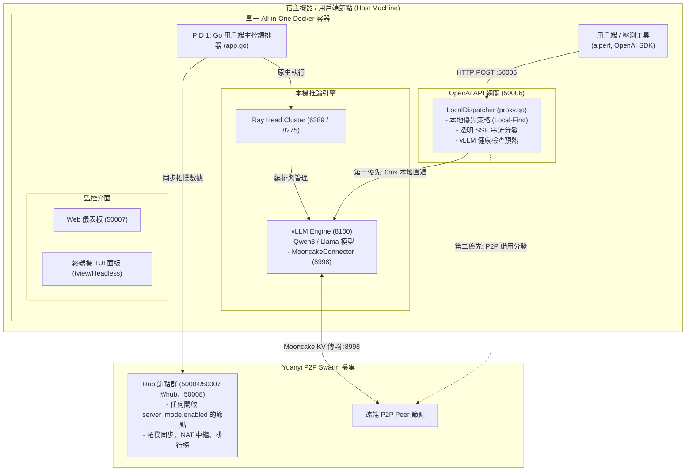

[English](README.md) | [繁體中文](README_zh-TW.md) | [简体中文](README_zh-CN.md)

# Yuanyi P2P LLM 推理用戶端 Agent

[](https://github.com/lhu-csie-dclab/yuanyi/actions)
[](https://github.com/lhu-csie-dclab/yuanyi/actions)
[](https://github.com/lhu-csie-dclab/yuanyi/actions)
[](https://github.com/lhu-csie-dclab/yuanyi/actions)
[](https://golang.org)
[](https://developer.nvidia.com/cuda-toolkit)
[](https://github.com/vllm-project/vllm)
[](https://github.com/kvcache-ai/Mooncake)
[](LICENSE)

一個去中心化的 P2P LLM 推理網路——**任何有 GPU 的人都能貢獻算力**，**任何有網路的人都能使用大語言模型**——無論是在家裡、在資料中心、還是用手機行動網路。

一個執行檔、一把共享金鑰，你就是全球 GPU 網格的一部分。不需要中央伺服器。

---

## 為什麼選擇 Yuanyi？

**在任何地方跑 LLM，由世界各地的 GPU 驅動。**

傳統的 LLM 部署把你鎖在一台機器或一個雲端服務商上。Yuanyi 把每一張參與的 GPU 變成全球推理網路的一個節點：

- **Prefill/Decode (P/D) 分離** — 推理流程拆分到不同節點：一台機器負責高運算量的 prefill 階段，另一台處理 token 生成。底層使用 [vLLM](https://github.com/vllm-project/vllm) 原生 P/D 分離搭配 [Mooncake KV-cache 傳輸](https://github.com/kvcache-ai/Mooncake)，KV cache 在 GPU 之間直接透過網路傳送，無需重新計算。

- **真正的 P2P 無中心依賴** — 基於 [libp2p](https://github.com/libp2p/go-libp2p)，採用 Kademlia DHT、GossipSub 以及自動 NAT 穿越（Hole Punching、UPnP、中繼）。區域網路透過 mDNS 自動發現，廣域網路透過 bootstrap 種子連線。任意數量的節點都可以充當 Hub——沒有單點故障。

- **任何 NAT 環境都能運作，包含手機網路** — 在 NAT4、CGNAT 或電信級防火牆後方的節點，仍然可以透過內建的 Circuit Relay 參與。只要有一個可達的中繼節點，**每個節點都能連上任何其他節點**——你家路由器後面的電腦、雲端 VM、手機熱點，全部在同一個 swarm 裡。

- **一把金鑰 = 一個私有網路** — 一個 `swarm.key` 檔案決定誰能加入。把它分享給你的團隊、實驗室或朋友——攜帶相同金鑰的節點會自動形成加密的私有網格。不需要帳號、不需要 API token、不需要註冊。

- **每個人都能貢獻** — 有強力 GPU？為網路執行推理。完全沒有 GPU？用**純中繼模式**貢獻網路頻寬，讓 NAT 後方的節點能夠互連。每一位參與者都讓網路更強大。

- **存取地球上每一張已連線的 GPU** — 你的本地閘道（`/v1/chat/completions`）完全相容 OpenAI API。當你自己的 GPU 忙碌或不存在時，請求會自動派發到 swarm 中最佳的可用節點。一個端點，全球 GPU 存取。

- **GPU 排行榜與智慧路由** — 每個節點每 3 秒廣播自己的 GPU 規格與吞吐量指標。Hub 節點使用 [gpu-info-api](https://github.com/voidful/gpu-info-api) 資料集，根據硬體能力（VRAM、型號、數量）為 GPU 評分，並發布即時排行榜。分發器會將請求路由到最快的可用節點。

---

> [!WARNING]
> **實驗階段與正式環境部署警語 (Experimental Stage Disclaimer)**
> - **實驗研究階段專案**：本軟體目前處於**實驗研究階段**，**不推薦在正式生產環境 (Production) 部署使用**。
> - **未測試參數聲明**：目前僅有文件明確記載的基準配置（`Qwen3-4B-AWQ`, `protocol: "tcp"`, `concurrency: 100`）經過壓力測試驗證；**其餘未經測試的參數、傳輸協定或模型未經完整驗證**，可能產生不可預期的系統行為。

> [!WARNING]
> **隱私警語：分發到遠端節點的 Prompt，該節點營運者看得到明文**
> - 當本機 GPU 忙碌時，請求會被分發到 **Swarm 中的其他機器**；這些機器必須解密才能執行推論。本專案**沒有應用層加密**，而且以目前技術而言 LLM 推論也做不到（同態加密不實用）。
> - `swarm.key` 控制的是**誰能加入**，不是「加入後能對收到的資料做什麼」。Swarm 裡**每一位節點營運者都被隱含信任**能接觸到使用者的 Prompt。
> - 你的節點還會**每 3 秒把你的 IP 位址、顯卡型號與使用習慣廣播給所有 Peer**，同時也會收到別人的。而**別人的 Prompt 會在你的 GPU 上執行**。
> - **📋 加入任何 Swarm 之前，請先閱讀 [使用者須知 (`docs/zh_tw/USER_NOTICE.md`)](docs/zh_tw/USER_NOTICE.md)** —— 你會暴露什麼、承擔什麼，以及共用 `swarm.key` 的風險。完整信任模型：**[`docs/SECURITY.md`](docs/SECURITY.md)**。

---

## 📚 技術文件與架構手冊索引

關於深度的技術文件、多層次架構規範與模組參考手冊，請參閱：

- **[📖 多層次系統架構規範 (`docs/zh_tw/ARCHITECTURE.md`)](docs/zh_tw/ARCHITECTURE.md)**：包含 8 大功能層級（編排器、網關、P2P Swarm、進程管理器、遙測、UI、選用的 Hub 模式）與演算法說明。
- **[📦 Master App 容器規範 (`docs/zh_tw/APP_CONTAINER.md`)](docs/zh_tw/APP_CONTAINER.md)**：`app.go` 主容器結構體、依賴注入、啟動與關機順序。
- **[⚙️ 設定管理與參數手冊 (`docs/zh_tw/CONFIG.md`)](docs/zh_tw/CONFIG.md)**：`config.go`、`config.json`、`.env.example` 與 `mooncake.json` 的完整指南。
- **[🌐 P2P 網路與 Swarm Key 手冊 (`docs/zh_tw/P2P_NETWORK.md`)](docs/zh_tw/P2P_NETWORK.md)**：`p2p.go`、Badger DB Peerstore、GossipSub、VIP 代理與 `swarm.key` 金鑰生成教學。
- **[🔀 OpenAI API 網關與代理手冊 (`docs/zh_tw/GATEWAY_PROXY.md`)](docs/zh_tw/GATEWAY_PROXY.md)**：`proxy.go` 本地優先透明 SSE 串流、vLLM 健康檢查與 P/D 調度器。
- **[🏃 進程管理與 Docker 堆疊手冊 (`docs/zh_tw/RUNNER_DOCKER.md`)](docs/zh_tw/RUNNER_DOCKER.md)**：`runner.go`、`Dockerfile`、`docker-compose.yml` 與 Ray/vLLM 編排。
- **[📊 系統遙測與指標手冊 (`docs/zh_tw/TELEMETRY_SYS.md`)](docs/zh_tw/TELEMETRY_SYS.md)**：`sys.go`、vLLM Prometheus 數據爬蟲、NVML 顯卡遙測與 `stats.json` 存檔。
- **[🖥️ 終端 TUI 面板與 Web 儀表板手冊 (`docs/zh_tw/DASHBOARD_UI.md`)](docs/zh_tw/DASHBOARD_UI.md)**：`tui.go`（4 分頁終端面板、Headless 模式）與 `web.go`（`50007` 埠內嵌 Web Console）。
- **[📈 NVIDIA AIPerf 壓測數據報告 (`docs/zh_tw/test/BENCHMARK_RESULTS.md`)](docs/zh_tw/test/BENCHMARK_RESULTS.md)**：在 10 張 RTX A2000 8GB 顯卡上進行 1 萬次請求壓測的官方數據。
- **[🧬 多節點全新 Clone 與併發多卡測試 (`docs/zh_tw/test/MULTI_NODE_CLONE_TEST.md`)](docs/zh_tw/test/MULTI_NODE_CLONE_TEST.md)**：驗證從零 `git clone` 部署到 2 台主機共 10 個獨立節點後，10 張實體 GPU 各自真的在處理推論（單獨測試與 10 台併發測試皆驗證）。
- **[📋 使用者須知 — 加入 Swarm 前必讀 (`docs/zh_tw/USER_NOTICE.md`)](docs/zh_tw/USER_NOTICE.md)**：你的節點會廣播你的哪些資訊（IP、顯卡、使用習慣）、你的 GPU 會跑到什麼、共用 `swarm.key` 的風險，以及哪些內容絕對不該輸入共用 Swarm。
- **[🔐 安全性與信任模型 (`docs/SECURITY.md`)](docs/SECURITY.md)**：本系統保護什麼、不保護什麼——為何遠端節點看得到被分發的 Prompt、`swarm.key` 真正保證的範圍，以及目前未加驗證的對外介面。
- **[🖥️ Proxmox VE + LXC GPU 直通手冊 (`docs/install/proxmox/README.md`)](docs/install/proxmox/README.md)**：宿主機驅動安裝、建立 LXC、GPU 裝置直通、巢狀 Docker 與 `no-cgroups` 關鍵修正——參考叢集的 10 個節點就是這樣建起來的。
- **[🐧 Ubuntu 安裝與部署手冊 (`docs/install/ubuntu/README.md`)](docs/install/ubuntu/README.md)**：主要且經過正式測試的部署平台——Docker Engine、NVIDIA Container Toolkit、`swarm.key`，以及 Docker 與原生編譯兩種部署路徑。
- **[🪟 Windows 本機原生架設與部署手冊 (`docs/install/windows/README.md`)](docs/install/windows/README.md)**：使用 `uv`、`.venv` 與 `SystemPanic/vllm-windows` 於 Windows 本機極速部署 vLLM + Qwen AWQ 的完整指南。
- **[🪟 Windows 原生部署驗證測試 (`docs/test/WINDOWS_NATIVE_TEST.md`)](docs/test/WINDOWS_NATIVE_TEST.md)**：在 RTX 3080 Laptop 上實際跑完整條 Windows 原生路徑的驗證結果——建置、啟動、單筆/循序/併發/串流推論，以及這次測試揪出並修復的兩個 Bug。
- **[🧪 實驗階段與未測試參數說明書 (`docs/zh_tw/EXPERIMENTAL.md`)](docs/zh_tw/EXPERIMENTAL.md)**：包含詳細的實驗研究範圍、經測試的基準設定、未測試參數風險與正式環境免責聲明。
- **[🗂 模組與 Function 參考指南 (`docs/zh_tw/MODULES.md`)](docs/zh_tw/MODULES.md)**：檔案對照表、資料結構與跨模組呼叫矩陣。
- **[🛰️ Hub 模式手冊 (`docs/zh_tw/HUB_MODE.md`)](docs/zh_tw/HUB_MODE.md)**：選用的中央伺服器合併能力——節點資料庫、GPU 算分、中央派發器、Hub 專屬儀表板，以及多 Hub 一致性設計。

---

## 🏛 系統架構圖 (System Architecture)



> 每個節點都跑同一份 client 執行檔。一個節點只有在自己的 `config.json` 設定
> `server_mode.enabled: true` 時，才會成為上圖 `Swarm` 裡的 **Hub**；可以同時有任意數量的節點這樣做，
> 而且任何節點無論是否兼任 Hub，都能作為 `ClientHost` 執行自己的推論。詳見
> [`docs/zh_tw/HUB_MODE.md`](docs/zh_tw/HUB_MODE.md)。

---

## ✨ 核心特色 (Key Features)

- **🚀 本地優先代理與零延遲 SSE 串流 (Local-First & Zero-Buffer SSE)**：
  採用 `http.Flusher` 將傳入的 HTTP 請求直接分發至本機 GPU 加速的 vLLM 引擎 (`http://127.0.0.1:8100`)。提供 0ms 網路額外開銷與完全相容於 `aiperf` 等壓測工具的 Server-Sent Events (SSE) 串流。
- **⚡ 原子級 vLLM 健康預熱檢查 (Atomic vLLM Readiness)**：
  背景任務每 5 秒輪詢 `http://127.0.0.1:8100/health`。在開機 15-30 秒的模型載入預熱期間自動抑制報錯，若本機未就緒則自動平滑退回 P2P Swarm 遠端 Peer 執行。
- **📦 單一 All-in-One 容器化部署 (Single-Container All-in-One)**：
  運行於多階段 Docker 容器中。Go Agent 作為 **PID 1** 原生管理 Ray Head 與 vLLM 進程，無須掛載 `/var/run/docker.sock` 或宿主機 shell 腳本。
- **🖥️ 雙監控介面支援 (互動式 TUI 與 Headless 背景模式)**：
  搭載基於 `tview` 的 4 分頁終端面板。自動偵測無 TTY 環境（如容器或背景服務），自動切換至 Headless 背景模式。

- **🎨 Vue 3 + Vite + Tailwind Web 儀表板**：
  Web 主控台（`web-ui/`）是用 Vue 3、Vite、Tailwind CSS v4 打造的 hash 路由單頁應用，編譯後透過 `embed.FS` 直接打進 Go 執行檔——執行期依然不需要外部前端檔案。Dockerfile 有獨立的 Node 建置階段，跑在 Go build 之前。
- **🌐 P2P Swarm 與 Mooncake KV Cache 傳輸**：
  透過 libp2p 連接 Yuanyi P2P Swarm，參與 Prefill/Decode (P/D) 分離推理拓撲，經由 `8998` 埠進行跨節點 KV Cache 傳輸。
- **🛰️ 選用 Hub 模式（合併中央伺服器能力）**：
  任何節點都可以開啟 `server_mode.enabled`，額外兼任原本獨立中央伺服器的角色：本機 SQLite 節點/排行榜資料庫、GPU 算分、中央 P/D 派發器、Hub 專屬儀表板。可以同時有多個 Hub 運作——每個 Hub 各自透過既有的 GossipSub 廣播收斂出相同視圖，沒有單點故障。詳見 [`docs/HUB_MODE.md`](docs/HUB_MODE.md)（英文）或 [`docs/zh_tw/HUB_MODE.md`](docs/zh_tw/HUB_MODE.md)（繁中）。

- **🔀 純中繼模式（沒有 GPU 也能貢獻）**：
  把 `server_mode.relay_only` 設為 `true`，就是**貢獻網路頻寬而非 GPU 算力**。節點會加入 Swarm 並提供 libp2p Circuit Relay 服務，讓 NAT 後方的節點能透過它互連，但**完全不啟動 Ray/vLLM —— 根本不需要顯卡**。它會廣播 `role: "relay"` 讓其他節點派工作時自動跳過它，而它自己的閘道照常運作，會把你的請求轉發給有 GPU 的節點。由於中繼轉發的是**已加密**的串流，別人的 Prompt 既不會在你的機器上執行，你也讀不到內容。詳見 [`docs/zh_tw/HUB_MODE.md`](docs/zh_tw/HUB_MODE.md)。

---

## 📁 檔案與技術手冊對照表 (Documentation Map)

| 原始碼檔案 / 組件 | 主要職責與功能 | 對應技術手冊直達連結 |
| :--- | :--- | :--- |
| **[`main.go`](main.go)** | 程式進入點與 OS 信號監聽 | [📖 Architecture Manual (`docs/zh_tw/ARCHITECTURE.md`)](docs/zh_tw/ARCHITECTURE.md#11-maingo---應用程式啟動器) |
| **[`app.go`](app.go)** | 主應用容器與模組編排 | [📦 Master App Specification (`docs/zh_tw/APP_CONTAINER.md`)](docs/zh_tw/APP_CONTAINER.md) |
| **[`config.go`](config.go)** / **[`config.json`](config.json)** | 設定解析與實體網卡自動偵測 | [⚙️ Config Guide (`docs/zh_tw/CONFIG.md`)](docs/zh_tw/CONFIG.md) |
| **[`proxy.go`](proxy.go)** | OpenAI API 網關與 Local-First 代理 | [🔀 Gateway Proxy Guide (`docs/zh_tw/GATEWAY_PROXY.md`)](docs/zh_tw/GATEWAY_PROXY.md) |
| **[`p2p.go`](p2p.go)** / **[`swarm.key.example`](swarm.key.example)** | libp2p 私網、GossipSub 與 VIP 代理 | [🌐 P2P Network & Key Guide (`docs/zh_tw/P2P_NETWORK.md`)](docs/zh_tw/P2P_NETWORK.md) |
| **[`runner.go`](runner.go)** / **[`Dockerfile`](Dockerfile)** | Ray Head 與 vLLM 推論進程管理 | [🏃 Process & Docker Guide (`docs/zh_tw/RUNNER_DOCKER.md`)](docs/zh_tw/RUNNER_DOCKER.md) |
| **[`sys.go`](sys.go)** / **[`stats.json`](stats.json)** | 顯卡 NVML 遙測與 Prometheus 爬蟲 | [📊 Telemetry & Metrics Guide (`docs/zh_tw/TELEMETRY_SYS.md`)](docs/zh_tw/TELEMETRY_SYS.md) |
| **[`tui.go`](tui.go)** / **[`web.go`](web.go)** / **[`web-ui/`](web-ui)** | TUI 終端面板與 Web 儀表板（Vue 3 + Vite + Tailwind）| [🖥️ User Interfaces Guide (`docs/zh_tw/DASHBOARD_UI.md`)](docs/zh_tw/DASHBOARD_UI.md) |
| **`server_*.go`**（選用） | Hub 模式：節點資料庫、算分、派發器、儀表板 | [🛰️ Hub Mode Guide (`docs/zh_tw/HUB_MODE.md`)](docs/zh_tw/HUB_MODE.md) |
| **`docs/test/`** | 10 x RTX A2000 壓測數據集 | [📈 AIPerf Benchmark Results (`docs/zh_tw/test/BENCHMARK_RESULTS.md`)](docs/zh_tw/test/BENCHMARK_RESULTS.md) |
| **`docs/test/`** | 10 節點全新 Clone + 併發多卡驗證 | [🧬 Multi-Node Clone Test (`docs/zh_tw/test/MULTI_NODE_CLONE_TEST.md`)](docs/zh_tw/test/MULTI_NODE_CLONE_TEST.md) |

---

## 🔌 網路埠號分配與對照參考表 (Network Ports)

| Port 埠號 | 協定 | 層級 / 服務 | 設定檔來源 | 說明 |
| :--- | :--- | :--- | :--- | :--- |
| **`50006`** | HTTP | OpenAI API Gateway | `config.json` (`proxy_port`) | Client API 進入點 (`/v1/chat/completions`, `/v1/models`) |
| **`50007`** | HTTP | Web UI 儀表板 | `config.json` / `.env` (`CLIENT_WEB_PORT`) | Vue SPA + Stats API；開啟 `server_mode.enabled` 時會出現 Cluster/Hub 分區（`/#/hub/*` hash 路由）|
| **`8100`** | HTTP | vLLM Engine | `config.json` (`vllm.port`) | 本機 GPU vLLM 推論伺服器端點 |
| **`8998`** | TCP/HTTP | Mooncake Engine | `config.json` (`mooncake_bootstrap_port`) | Mooncake KV Cache 傳輸控制與協商埠 |
| **`6389`** | TCP | Python Ray Cluster | Ray Head (`--port`) | Ray 分散式執行 Head 節點埠 |
| **`8275`** | HTTP | Python Ray Dashboard | Ray Head (`--dashboard-port`) | Ray 叢集 Web 管理儀表板 |
| **`50004`** | TCP/libp2p | Bootstrap 種子節點 | `config.json` (`p2p.server_address(es)`) | Bootstrap Tracker 與 NAT 中繼 multiaddress 埠（本節點兼任 Hub 時同 `server_mode.p2p_port`） |
| **`50008`** | HTTP | Hub 派發器（選用） | `config.json` (`server_mode.proxy_port`) | Hub 中央 P/D 派發，僅 `server_mode.enabled` 時啟用（儀表板的拓樸/排行榜頁面改在上面的 `50007`）|

---

## ⚡ 一行指令安裝 (Linux)

`install.sh` 用互動選單涵蓋完整生命週期——安裝、解除安裝、模型管理——除非你想手動操作，
否則不需要照著下面的步驟一步步做。

```bash
curl -fsSL https://raw.githubusercontent.com/lhu-csie-dclab/yuanyi/main/install.sh -o install.sh
bash install.sh
```

每一項都會詢問，並附上合理的預設值（直接按 Enter 就是接受預設）：

| 詢問項目 | 預設值 |
| :--- | :--- |
| 安裝目錄 | root 身分為 `/opt/yuanyi-client`，否則 `~/yuanyi-client` |
| 節點角色 | 推論節點，或**純中繼站**（不需要顯卡） |
| `swarm.key` | 貼上既有金鑰以加入現有 Swarm，或**留空自動產生新的** |
| 模型 | 任何 Hugging Face repo id，例如 `Qwen/Qwen3-4B-AWQ` |
| 連接埠 | `50007` 網頁、`50006` 閘道、`8100` vLLM —— 也可自訂 |

模型管理隨時都能從同一支腳本進入：

```bash
bash install.sh models     # 下載 / 更換 / 刪除模型
bash install.sh status     # 查看安裝狀態與是否正在執行
bash install.sh uninstall  # 解除安裝（會詢問是否備份 swarm.key、是否保留模型）
```

> [!NOTE]
> 解除安裝**只會刪除它自己建立的目錄**。它會先詢問是否備份 `swarm.key`（這把金鑰無法復原，
> 而且整個 Swarm 共用），並且**另外分開詢問**是否刪除已下載的模型——模型存放在安裝目錄之外。

---

## 🛠️ 環境準備與安裝步驟 (Prerequisites)

### 1. Git 安裝與專案複製
在系統中安裝 `git` 並複製儲存庫：

```bash
# Ubuntu / Debian
sudo apt-get update && sudo apt-get install -y git git-lfs

# 複製儲存庫
git clone https://github.com/lhu-csie-dclab/yuanyi.git
cd yuanyi
```

### 2. Go 環境與本機編譯
本專案需要 **Go 1.26.0 或更高版本**。Web 儀表板（`web-ui/`）是透過 `//go:embed` 在編譯期打進執行檔的，
所以 `go build` 之前必須先有建置好的 `web-ui/dist/`。Docker 建置會自動處理；若要在 Docker 之外本機編譯，
需要 **Node.js 22+** 先建置一次儀表板：

```bash
# 檢查 Go 版本 (需要 1.26.0+)
go version

# 先建置一次 Web 儀表板（只有非 Docker 建置才需要，web-ui/dist/ 不進版控）
cd web-ui && npm ci && npm run build && cd ..

# 本機編譯執行檔
go build -v .
```

### 3. Ubuntu 上安裝 Docker
編譯 `Dockerfile` 需要安裝 Docker Engine，請參考 [Docker Engine Installation on Ubuntu](https://docs.docker.com/engine/install/ubuntu/) 官方文件：

```bash
# 解除安裝舊版本
sudo apt-get remove docker docker-engine docker.io containerd runc

# 設定 Docker 儲存庫
sudo apt-get update
sudo apt-get install -y ca-certificates curl gnupg
sudo install -m 0755 -d /etc/apt/keyrings
curl -fsSL https://download.docker.com/linux/ubuntu/gpg | sudo gpg --dearmor -o /etc/apt/keyrings/docker.gpg
sudo chmod a+r /etc/apt/keyrings/docker.gpg

echo \
  "deb [arch="$(dpkg --print-architecture)" signed-by=/etc/apt/keyrings/docker.gpg] https://download.docker.com/linux/ubuntu \
  "$(. /etc/os-release && echo "$VERSION_CODENAME")" stable" | \
  sudo tee /etc/apt/sources.list.d/docker.list > /dev/null

# 安裝 Docker Engine & Docker Compose
sudo apt-get update
sudo apt-get install -y docker-ce docker-ce-cli containerd.io docker-buildx-plugin docker-compose-plugin

# 驗證 Docker 安裝
docker --version
```

> [!NOTE]
> **內建套件版本說明**：已內建官方 CUDA 13 Mooncake 傳輸引擎版本 `mooncake-transfer-engine-cuda13==0.3.10.post2`。

### 4. NVIDIA GPU Container Toolkit
請確保已安裝 [NVIDIA Container Toolkit](https://docs.nvidia.com/datacenter/cloud-native/container-toolkit/latest/install-guide.html)，使 Docker 容器能存取顯卡硬體。

#### 🧪 測試環境驗證規格 (Verified Test Environment)
本系統已在以下 LXC 容器環境完成壓測與驗證：

| 項目 (Category) | 規格 (Specification) |
| :--- | :--- |
| **虛擬化平台 (Hypervisor)** | **Proxmox VE 9.1** (LXC Container) |
| **LXC OS 範本** | `ubuntu-26.04-standard_26.04-1_amd64.tar.zst` |
| **NVIDIA 宿主機驅動版本** | `595.71.05` |
| **CUDA Toolkit 版本** | `13.2` |
| **GPU 計算能力 (Compute Capability)** | **`7.5`** (Turing 繪圖架構) |

### 5. 下載演示模型 (`Qwen/Qwen3-4B-AWQ`)
目前預設模型為 **[Qwen/Qwen3-4B-AWQ](https://huggingface.co/Qwen/Qwen3-4B-AWQ)**——同時也是 benchmark 實測用的模型(見 [BENCHMARK_RESULTS.md](docs/test/BENCHMARK_RESULTS.md))。這是純文字模型,Chat 頁面的圖片附加功能需要換成支援視覺辨識的模型(例如 Qwen-VL 系列)才能實際使用：

```bash
# 安裝 Git LFS
git lfs install

# 下載模型至本機資料夾
mkdir -p /home/user/models
cd /home/user/models
git clone https://huggingface.co/Qwen/Qwen3-4B-AWQ
```

---

## 🚀 快速開始與部署 (Quick Start)

### 1. 環境變數設定

複製環境變數範本檔：

```bash
cp .env.example .env
```

編輯 `.env` 將 `ABS_MODEL_PATH` 指向本機模型的絕對路徑：

```env
# 本機 HuggingFace / AWQ 模型權重絕對路徑
ABS_MODEL_PATH=/home/user/models/Qwen3-4B-AWQ
IFACE=eth0
CLIENT_WEB_PORT=50007
```

### 2. 產生私有網路金鑰 (`swarm.key`)

> [!IMPORTANT]
> **請在第一次啟動之前完成這一步。** 沒有有效的 `swarm.key`，節點會直接拒絕啟動；而且
> **同一個 Swarm 裡的每個節點都必須持有位元組完全相同的金鑰**——它就是定義這個私有網路的
> 預共享金鑰 (PSK)。

**要建立一個全新的 Swarm？** 產生一把新的金鑰：

```bash
printf '/key/swarm/psk/1.0.0/\n/base16/\n%s\n' "$(openssl rand -hex 32)" > swarm.key
```

**要加入既有的 Swarm？** 請**不要**自己產生——向該 Swarm 的管理者取得那把一模一樣的
`swarm.key` 並原封不動放進來。金鑰不一致時的錯誤訊息是
`failed to negotiate security protocol: incoming message was too large`，看起來像網路故障
而不是金鑰問題，非常容易誤判。可以用 `sha256sum swarm.key` 跟正常運作的節點比對確認。

> [!WARNING]
> **不要**直接拿 `swarm.key.example` 當成正式金鑰。它是提交在這個 repo 裡的公開範例檔，
> 任何人都能用它加入你的 Swarm。請妥善保管真正的 `swarm.key`，不要進版控
> （`.gitignore` 已經排除它）。

檔案格式與其他產生方式請見 [`docs/zh_tw/P2P_NETWORK.md`](docs/zh_tw/P2P_NETWORK.md)。

### 3. 編譯與啟動容器

透過 Docker Compose 編譯並啟動 All-in-One 服務：

```bash
docker compose up -d --build
```

### 4. 驗證系統健康狀態

檢查 API 網關健康狀態 (`50006`)：

```bash
curl http://localhost:50006/health
# 輸出: OK
```

查詢目前支援的模型：

```bash
curl http://localhost:50006/v1/models
```

### 5. 執行對話推理 (Chat Completion)

發送相容於 OpenAI 格式的請求：

```bash
curl http://localhost:50006/v1/chat/completions \
  -H "Content-Type: application/json" \
  -d '{
    "model": "Qwen/Qwen3-4B-AWQ",
    "messages": [{"role": "user", "content": "你好！請用兩句話解釋量子電腦。"}],
    "temperature": 0.7
  }'
```

### 6. 🪟 Windows 本機原生極速部署 (Windows Native Quick Start)

本專案支援在 Windows 10/11 原生運行，無需依賴 Docker。請依照以下極簡步驟完成前置：

**最省事的方式 —— 安裝腳本會全部幫你做完：**

```powershell
irm https://raw.githubusercontent.com/lhu-csie-dclab/yuanyi/main/install.ps1 -OutFile install.ps1
powershell -ExecutionPolicy Bypass -File install.ps1
```

選單跟 Linux 的 `install.sh` 一樣（安裝／解除安裝／下載／更換／刪除模型），會詢問安裝路徑、
`swarm.key`（留空即自動產生）、連接埠與模型，**並且會連 Python + vLLM 環境一起幫你建好**。
第一個問題選 **relay-only（純中繼）** 就能在沒有顯卡的機器上貢獻，會直接跳過 Python 環境
與模型下載。

如果你想自己手動操作，下面的步驟依然適用。

#### 步驟 1: 使用 `uv` 建立虛擬環境與安裝依賴 (只需執行一次)
```powershell
# 1. 建立 Python 3.12 虛擬環境
uv venv .venv --python 3.12

# 2. 安裝 PyTorch (CUDA 12.4 版)
uv pip install torch==2.6.0+cu124 torchvision==0.21.0+cu124 torchaudio==2.6.0+cu124 --extra-index-url https://download.pytorch.org/whl/cu124

# 3. 安裝下載之 Windows 專用 vLLM Wheel 與相容 Transformers
#    上下限都不能省：Qwen3 需要 >=4.51，而 5.x 移除了 vLLM 0.9.2 仍在呼叫的 API。
uv pip install vllm-0.9.2+cu124-cp312-cp312-win_amd64.whl
uv pip install "transformers>=4.51.0,<5.0.0"
```

#### 步驟 2: 啟動 Client Agent
```powershell
# 執行編譯好的二進位檔案 (或自行 go build .)
.\go-p2p.exe
```
* 程式會**全自動識別 Windows 平台**，呼叫 `nvidia-smi` 檢測顯卡，並自動調用本機 `.venv` 啟動 vLLM 與 P2P 網路！
* 完整教學與背景常駐設定請參閱 **[🪟 Windows 部署手冊 (`docs/install/windows/README.md`)](docs/install/windows/README.md)**。

---

## ⚙️ 設定檔參考 (Configuration Reference)

`config.json` 預設設定：

```json
{
  "web_port": 50007,
  "proxy_port": 50006,
  "vllm": {
    "port": 8100,
    "model_name": "Qwen/Qwen3-4B-AWQ",
    "gpu_memory_utilization": 0.95,
    "max_model_len": 16384,
    "max_num_seqs": 32,
    "kv_role": "kv_both",
    "mooncake_bootstrap_port": 8998
  },
  "server_mode": {
    "enabled": false
  }
}
```

設定 `server_mode.enabled: true` 即可讓這個節點兼任 Hub（合併中央伺服器能力）——完整欄位說明見
[`docs/HUB_MODE.md`](docs/HUB_MODE.md)（英文）或 [`docs/zh_tw/HUB_MODE.md`](docs/zh_tw/HUB_MODE.md)（繁中）。

`mooncake.json` 傳輸協定設定 (`"protocol": "tcp"`)：

```json
{
  "metadata_server": "P2PHANDSHAKE",
  "global_segment_size": "0",
  "local_buffer_size": "17179869184",
  "protocol": "tcp",
  "device_name": ""
}
```

---

## 🙏 開源致謝與引用 (Acknowledgements)

Yuanyi Client Agent 基於以下卓越的開源專案建構而成：

- **[vLLM](https://github.com/vllm-project/vllm)** - 高吞吐量與記憶體高效的 LLM 推理服務引擎。
- **[vllm-windows](https://github.com/SystemPanic/vllm-windows)** (SystemPanic/vllm-windows) - 提供 Windows 平台專用的高效能 vLLM 編譯構建與環境相容性支援。
- **[Mooncake](https://github.com/kvcache-ai/Mooncake)** - 以 KVCache 為中心的分離式 LLM 服務架構。
- **[go-libp2p](https://github.com/libp2p/go-libp2p)** - 模組化 P2P 網路庫。
- **[gpu-info-api](https://github.com/voidful/gpu-info-api)** (voidful/gpu-info-api) - GPU 規格資料集（資料萃取自 Wikipedia），供 Hub 的貢獻度算分引擎依據回報的 GPU 型號字串解析出 VRAM 容量。
- **[Ray](https://github.com/ray-project/ray)** - 分散式 AI 與 Python 擴充框架。
- **[aiperf](https://github.com/ai-dynamo/aiperf)** (`nvcr.io/nvidia/ai-dynamo/aiperf`) - 生成式 AI 推理服務壓測工具。

---

## 📜 授權條款 (License)

本專案採用 **Apache License 2.0** 授權。詳情請參閱 [`LICENSE`](LICENSE)。
