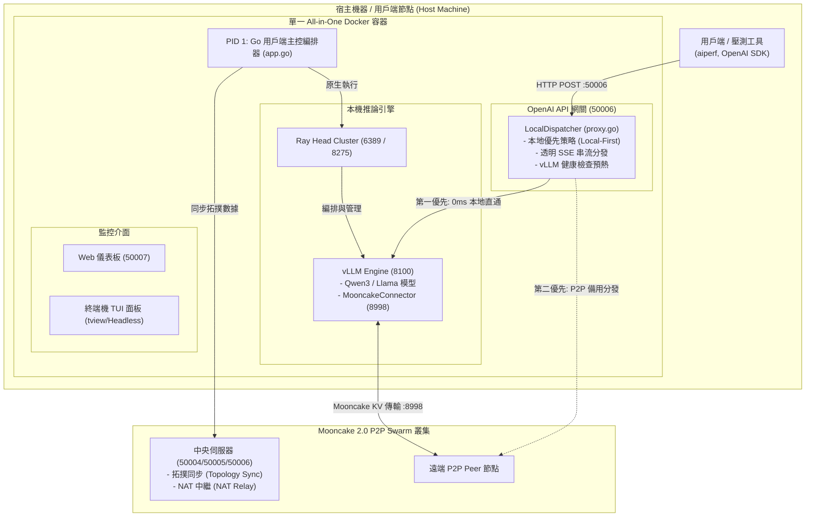

# Mooncake 2.0 P2P LLM 推理用戶端 Agent

[English](README.md) | [繁體中文](README_zh-TW.md) | [简体中文](README_zh-CN.md)

[](https://github.com/lhu-csie-dclab/yuanyi/actions)
[](https://github.com/lhu-csie-dclab/yuanyi/actions)
[](https://github.com/lhu-csie-dclab/yuanyi/actions)
[](https://github.com/lhu-csie-dclab/yuanyi/actions)
[](https://golang.org)
[](https://developer.nvidia.com/cuda-toolkit)
[](https://github.com/vllm-project/vllm)
[](https://github.com/kvcache-ai/Mooncake)
[](LICENSE)

基於 Go、libp2p、Ray 與 vLLM 建構的高效能全功能 **P2P 大語言模型 (LLM) 分散式推理 Agent 用戶端**。

Mooncake 2.0 Client 提供相容於 OpenAI 規範的 API 網關 Gateway (`/v1/chat/completions`)，具備 **Local-First 本地優先代理分發**、**透明零延遲 SSE 串流**、**vLLM 健康狀態自動預熱檢查**，以及整合 **Mooncake KV Cache 傳輸引擎** (`mooncake-transfer-engine-cuda13==0.3.10.post2`)，支援 Prefill/Decode (P/D) 分離推理叢集。

---

> [!WARNING]
> **實驗階段與正式環境部署警語 (Experimental Stage Disclaimer)**
> - **實驗研究階段專案**：本軟體目前處於**實驗研究階段**，**不推薦在正式生產環境 (Production) 部署使用**。
> - **未測試參數聲明**：目前僅有文件明確記載的基準配置（`Qwen3-4B-AWQ`, `protocol: "tcp"`, `concurrency: 100`）經過壓力測試驗證；**其餘未經測試的參數、傳輸協定或模型未經完整驗證**，可能產生不可預期的系統行為。

---

## 📚 技術文件與架構手冊索引

關於深度的技術文件、多層次架構規範與模組參考手冊，請參閱：

- **[📖 多層次系統架構規範 (`docs/ARCHITECTURE.md`)](docs/ARCHITECTURE.md)**：包含 7 大功能層級（編排器、網關、P2P Swarm、進程管理器、遙測、UI）與演算法說明。
- **[📦 Master App 容器規範 (`docs/APP_CONTAINER.md`)](docs/APP_CONTAINER.md)**：`app.go` 主容器結構體、依賴注入、啟動與關機順序。
- **[⚙️ 設定管理與參數手冊 (`docs/CONFIG.md`)](docs/CONFIG.md)**：`config.go`、`config.json`、`.env.example` 與 `mooncake.json` 的完整指南。
- **[🌐 P2P 網路與 Swarm Key 手冊 (`docs/P2P_NETWORK.md`)](docs/P2P_NETWORK.md)**：`p2p.go`、Badger DB Peerstore、GossipSub、VIP 代理與 `swarm.key` 金鑰生成教學。
- **[🔀 OpenAI API 網關與代理手冊 (`docs/GATEWAY_PROXY.md`)](docs/GATEWAY_PROXY.md)**：`proxy.go` 本地優先透明 SSE 串流、vLLM 健康檢查與 P/D 調度器。
- **[🏃 進程管理與 Docker 堆疊手冊 (`docs/RUNNER_DOCKER.md`)](docs/RUNNER_DOCKER.md)**：`runner.go`、`Dockerfile`、`docker-compose.yml` 與 Ray/vLLM 編排。
- **[📊 系統遙測與指標手冊 (`docs/TELEMETRY_SYS.md`)](docs/TELEMETRY_SYS.md)**：`sys.go`、vLLM Prometheus 數據爬蟲、NVML 顯卡遙測與 `stats.json` 存檔。
- **[🖥️ 終端 TUI 面板與 Web 儀表板手冊 (`docs/DASHBOARD_UI.md`)](docs/DASHBOARD_UI.md)**：`tui.go`（4 分頁終端面板、Headless 模式）與 `web.go`（`50007` 埠內嵌 Web Console）。
- **[📈 NVIDIA AIPerf 壓測數據報告 (`docs/test/BENCHMARK_RESULTS.md`)](docs/test/BENCHMARK_RESULTS.md)**：在 10 張 RTX A2000 8GB 顯卡上進行 1 萬次請求壓測的官方數據。
- **[🗂 模組與 Function 參考指南 (`docs/MODULES.md`)](docs/MODULES.md)**：檔案對照表、資料結構與跨模組呼叫矩陣。

---

## 🏛 系統架構圖 (System Architecture)



---

## ✨ 核心特色 (Key Features)

- **🚀 本地優先代理與零延遲 SSE 串流 (Local-First & Zero-Buffer SSE)**：
  採用 `http.Flusher` 將傳入的 HTTP 請求直接分發至本機 GPU 加速的 vLLM 引擎 (`http://127.0.0.1:8100`)。提供 0ms 網路額外開銷與完全相容於 `aiperf` 等壓測工具的 Server-Sent Events (SSE) 串流。
- **⚡ 原子級 vLLM 健康預熱檢查 (Atomic vLLM Readiness)**：
  背景任務每 5 秒輪詢 `http://127.0.0.1:8100/health`。在開機 15-30 秒的模型載入預熱期間自動抑制報錯，若本機未就緒則自動平滑退回 P2P Swarm 遠端 Peer 執行。
- **📦 單一 All-in-One 容器化部署 (Single-Container All-in-One)**：
  運行於多階段 Docker 容器中。Go Agent 作為 **PID 1** 原生管理 Ray Head 與 vLLM 進程，無須掛載 `/var/run/docker.sock` 或宿主機 shell 腳本。
- **🖥️ 雙監控介面支援 (互動式 TUI 與 Headless 背景模式)**：
  搭載基於 `tview` 的 4 分頁終端面板。自動偵測無 TTY 環境（如容器或背景服務），自動切換至 Headless 背景模式。
- **🌐 P2P Swarm 與 Mooncake KV Cache 傳輸**：
  透過 libp2p 連接 Mooncake 2.0 中央中繼伺服器，參與 Prefill/Decode (P/D) 分離推理拓撲，經由 `8998` 埠進行跨節點 KV Cache 傳輸。

---

## 📁 檔案與技術手冊對照表 (Documentation Map)

| 原始碼檔案 / 組件 | 主要職責與功能 | 對應技術手冊直達連結 |
| :--- | :--- | :--- |
| **[`main.go`](main.go)** | 程式進入點與 OS 信號監聽 | [📖 Architecture Manual (`docs/ARCHITECTURE.md`)](docs/ARCHITECTURE.md#11-maingo---application-bootstrapper) |
| **[`app.go`](app.go)** | 主應用容器與模組編排 | [📦 Master App Specification (`docs/APP_CONTAINER.md`)](docs/APP_CONTAINER.md) |
| **[`config.go`](config.go)** / **[`config.json`](config.json)** | 設定解析與實體網卡自動偵測 | [⚙️ Config Guide (`docs/CONFIG.md`)](docs/CONFIG.md) |
| **[`proxy.go`](proxy.go)** | OpenAI API 網關與 Local-First 代理 | [🔀 Gateway Proxy Guide (`docs/GATEWAY_PROXY.md`)](docs/GATEWAY_PROXY.md) |
| **[`p2p.go`](p2p.go)** / **[`swarm.key.example`](swarm.key.example)** | libp2p 私網、GossipSub 與 VIP 代理 | [🌐 P2P Network & Key Guide (`docs/P2P_NETWORK.md`)](docs/P2P_NETWORK.md) |
| **[`runner.go`](runner.go)** / **[`Dockerfile`](Dockerfile)** | Ray Head 與 vLLM 推論進程管理 | [🏃 Process & Docker Guide (`docs/RUNNER_DOCKER.md`)](docs/RUNNER_DOCKER.md) |
| **[`sys.go`](sys.go)** / **[`stats.json`](stats.json)** | 顯卡 NVML 遙測與 Prometheus 爬蟲 | [📊 Telemetry & Metrics Guide (`docs/TELEMETRY_SYS.md`)](docs/TELEMETRY_SYS.md) |
| **[`tui.go`](tui.go)** / **[`web.go`](web.go)** | TUI 終端面板與 Web 儀表板 | [🖥️ User Interfaces Guide (`docs/DASHBOARD_UI.md`)](docs/DASHBOARD_UI.md) |
| **`docs/test/`** | 10 x RTX A2000 壓測數據集 | [📈 AIPerf Benchmark Results (`docs/test/BENCHMARK_RESULTS.md`)](docs/test/BENCHMARK_RESULTS.md) |

---

## 🔌 網路埠號分配與對照參考表 (Network Ports)

| Port 埠號 | 協定 | 層級 / 服務 | 設定檔來源 | 說明 |
| :--- | :--- | :--- | :--- | :--- |
| **`50006`** | HTTP | OpenAI API Gateway | `config.json` (`proxy_port`) | Client API 進入點 (`/v1/chat/completions`, `/v1/models`) |
| **`50007`** | HTTP | Web UI 儀表板 | `config.json` / `.env` (`CLIENT_WEB_PORT`) | 視覺化監控 Web 主控台與 Stats API |
| **`8100`** | HTTP | vLLM Engine | `config.json` (`vllm.port`) | 本機 GPU vLLM 推論伺服器端點 |
| **`8998`** | TCP/HTTP | Mooncake Engine | `config.json` (`mooncake_bootstrap_port`) | Mooncake KV Cache 傳輸控制與協商埠 |
| **`6389`** | TCP | Python Ray Cluster | Ray Head (`--port`) | Ray 分散式執行 Head 節點埠 |
| **`8275`** | HTTP | Python Ray Dashboard | Ray Head (`--dashboard-port`) | Ray 叢集 Web 管理儀表板 |
| **`50004`** | TCP/libp2p | Central Server | `config.json` (`p2p.server_address`) | 中央 Bootstrap Tracker 與 NAT 中繼 multiaddress 埠 |

---

## 🛠️ 環境準備與安裝步驟 (Prerequisites)

### 1. Git 安裝與專案複製
在系統中安裝 `git` 並複製儲存庫：

```bash
# Ubuntu / Debian
sudo apt-get update && sudo apt-get install -y git git-lfs

# 複製儲存庫
git clone https://github.com/lhu-csie-dclab/yuanyi.git
cd yuanyi
```

### 2. Go 環境與本機編譯
本專案需要 **Go 1.26.0 或更高版本**：

```bash
# 檢查 Go 版本 (需要 1.26.0+)
go version

# 本機編譯執行檔
go build -v .
```

### 3. Ubuntu 上安裝 Docker
編譯 `Dockerfile` 需要安裝 Docker Engine，請參考 [Docker Engine Installation on Ubuntu](https://docs.docker.com/engine/install/ubuntu/) 官方文件：

```bash
# 解除安裝舊版本
sudo apt-get remove docker docker-engine docker.io containerd runc

# 設定 Docker 儲存庫
sudo apt-get update
sudo apt-get install -y ca-certificates curl gnupg
sudo install -m 0755 -d /etc/apt/keyrings
curl -fsSL https://download.docker.com/linux/ubuntu/gpg | sudo gpg --dearmor -o /etc/apt/keyrings/docker.gpg
sudo chmod a+r /etc/apt/keyrings/docker.gpg

echo \
  "deb [arch="$(dpkg --print-architecture)" signed-by=/etc/apt/keyrings/docker.gpg] https://download.docker.com/linux/ubuntu \
  "$(. /etc/os-release && echo "$VERSION_CODENAME")" stable" | \
  sudo tee /etc/apt/sources.list.d/docker.list > /dev/null

# 安裝 Docker Engine & Docker Compose
sudo apt-get update
sudo apt-get install -y docker-ce docker-ce-cli containerd.io docker-buildx-plugin docker-compose-plugin

# 驗證 Docker 安裝
docker --version
```

> [!NOTE]
> **Docker Build 依賴說明**：容器建置時會自動安裝 CUDA 13 Mooncake 傳輸引擎：
> ```dockerfile
> RUN pip install --no-cache-dir "ray[default,adag]" "mooncake-transfer-engine-cuda13==0.3.10.post2"
> ```

### 4. NVIDIA GPU Container Toolkit
請確保已安裝 [NVIDIA Container Toolkit](https://docs.nvidia.com/datacenter/cloud-native/container-toolkit/latest/install-guide.html)，使 Docker 容器能存取顯卡硬體。

#### 🧪 測試環境驗證規格 (Verified Test Environment)
本系統已在以下 LXC 容器環境完成壓測與驗證：

| 項目 (Category) | 規格 (Specification) |
| :--- | :--- |
| **虛擬化平台 (Hypervisor)** | **Proxmox VE 9.1** (LXC Container) |
| **LXC OS 範本** | `ubuntu-26.04-standard_26.04-1_amd64.tar.zst` |
| **NVIDIA 宿主機驅動版本** | `595.71.05` |
| **CUDA Toolkit 版本** | `13.2` |
| **GPU 計算能力 (Compute Capability)** | **`7.5`** (Turing 繪圖架構) |

### 5. 下載演示模型 (`Qwen3-4B-AWQ`)
推薦的測試展示模型為 **[Qwen/Qwen3-4B-AWQ](https://huggingface.co/Qwen/Qwen3-4B-AWQ)**：

```bash
# 安裝 Git LFS
git lfs install

# 下載 Qwen3-4B-AWQ 模型至本機資料夾
mkdir -p /home/user/models
cd /home/user/models
git clone https://huggingface.co/Qwen/Qwen3-4B-AWQ
```

---

## 🚀 快速開始與部署 (Quick Start)

### 1. 環境變數設定

複製環境變數範本檔：

```bash
cp .env.example .env
```

編輯 `.env` 將 `ABS_MODEL_PATH` 指向本機模型的絕對路徑：

```env
# 本機 HuggingFace / AWQ 模型權重絕對路徑
ABS_MODEL_PATH=/home/user/models/Qwen3-4B-AWQ
IFACE=eth0
CLIENT_WEB_PORT=50007
```

### 2. 編譯與啟動容器

透過 Docker Compose 編譯並啟動 All-in-One 服務：

```bash
docker compose up -d --build
```

### 3. 驗證系統健康狀態

檢查 API 網關健康狀態 (`50006`)：

```bash
curl http://localhost:50006/health
# 輸出: OK
```

查詢目前支援的模型：

```bash
curl http://localhost:50006/v1/models
```

### 4. 執行對話推理 (Chat Completion)

發送相容於 OpenAI 格式的請求：

```bash
curl http://localhost:50006/v1/chat/completions \
  -H "Content-Type: application/json" \
  -d '{
    "model": "Qwen3-4B-AWQ",
    "messages": [{"role": "user", "content": "你好！請用兩句話解釋量子電腦。"}],
    "temperature": 0.7
  }'
```

---

## ⚙️ 設定檔參考 (Configuration Reference)

`config.json` 預設設定：

```json
{
  "web_port": 50007,
  "proxy_port": 50006,
  "vllm": {
    "port": 8100,
    "model_name": "Qwen3-4B-AWQ",
    "gpu_memory_utilization": 0.75,
    "max_model_len": 8192,
    "kv_role": "kv_both",
    "mooncake_bootstrap_port": 8998
  }
}
```

`mooncake.json` 傳輸協定設定 (`"protocol": "tcp"`)：

```json
{
  "metadata_server": "P2PHANDSHAKE",
  "global_segment_size": "0",
  "local_buffer_size": "17179869184",
  "protocol": "tcp",
  "device_name": ""
}
```

---

## 🙏 開源致謝與引用 (Acknowledgements)

Mooncake 2.0 Client Agent 基於以下卓越的開源專案建構而成：

- **[vLLM](https://github.com/vllm-project/vllm)** - 高吞吐量與記憶體高效的 LLM 推理服務引擎。
- **[Mooncake](https://github.com/kvcache-ai/Mooncake)** - 以 KVCache 為中心的分離式 LLM 服務架構。
- **[go-libp2p](https://github.com/libp2p/go-libp2p)** - 模組化 P2P 網路庫。
- **[Ray](https://github.com/ray-project/ray)** - 分散式 AI 與 Python 擴充框架。
- **[aiperf](https://github.com/ai-dynamo/aiperf)** (`nvcr.io/nvidia/ai-dynamo/aiperf`) - 生成式 AI 推理服務壓測工具。

---

## 📜 授權條款 (License)

本專案採用 **Apache License 2.0** 授權。詳情請參閱 [`LICENSE`](LICENSE)。
